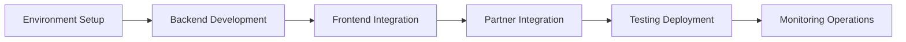

# TaskOn WhiteLabel Solution Implementation Guide

## Technical Feasibility Assessment

After detailed code analysis and architecture evaluation, it is confirmed that the white-label technical solution is **completely feasible**. The following are core validation results:

### ✅ Technical Feasibility Confirmation

#### 1. **Backend Authentication System** - Feasible

- `taskon-server/api/auth/auth.go` has complete JWT authentication middleware
- `AuthVerification` method supports extension, dual token mechanism can be easily added
- Redis is already configured and can be used for token mapping storage

#### 2. **Partner Signature Verification** - Feasible

- Partners are responsible for verifying user identity (wallet signature, email password, OAuth, etc.)
- TaskOn only needs to verify partner signatures, ensuring requests come from trusted partners
- Simplified architecture, no need to modify taskon-ont service

#### 3. **Community Join Function** - Feasible

- `DoJoinCommunity` API already exists and is complete
- Supports silent join (doJoin=true)
- Can be encapsulated as white-label dedicated service

#### 4. **Frontend iframe Support** - Feasible

- Already has `IS_IN_IFRAME` and `IS_THIRD_PARTY_DOMAIN` constants
- Community page component structure is clear and easy to modify
- Already supports cross-domain OAuth callback handling

#### 5. **HTTP Route Extension** - Feasible

- Uses chi router, supports route groups
- `Start()` method can add new route registration
- Middleware chain mechanism is mature

### 🎯 Solution Highlights

1. **Minimal Intrusion**

   - Through middleware and decorator patterns, core business logic remains unchanged
   - Uses existing Note, Tips fields to pass white-label information
   - New components are independent, no impact on existing functionality
2. **Reuse Existing Capabilities**

   - Reuse JWT authentication system
   - Reuse multi-chain signature verification
   - Reuse community management functions
   - Reuse OAuth processes
3. **Configuration-Driven Design**

   - Manage partner information through configuration tables
   - Dynamically load white-label styles
   - No code modification needed to integrate new partners

### ⚠️ Risk Points and Mitigation Measures

1. **Cross-Domain Cookie Restrictions**

   - Risk: Safari ITP may block third-party cookies
   - Mitigation: Use localStorage + postMessage backup solution
2. **iframe Communication Security**

   - Risk: Message forgery and man-in-the-middle attacks
   - Mitigation: Verify message origin, use encrypted channels
3. **Token Security**

   - Risk: Token leakage and replay attacks
   - Mitigation: Shadow tokens for internal use, regular key rotation

## Quick Start

This guide provides implementation paths for TaskOn white-label solution, used in conjunction with main solution and detailed design documents.

### Implementation Process



## Part One: Environment Setup

### 1.1 Development Environment Requirements

#### Backend Environment

- Go 1.19+
- MySQL 8.0+
- Redis 6.0+
- RabbitMQ 3.8+ (optional)
- ETCD 3.5+ (optional)

#### Frontend Environment

- Node.js 16+
- pnpm 7+
- Vue 3.x

### 1.2 Project Structure

```
taskOnGo/
├── taskon-server/        # Main service (needs modification)
├── taskon-ont/          # Signature service (no modification needed)
├── taskon-website/      # Frontend project (needs modification)
└── @taskon/partner-sdk/ # New npm package
```

### 1.3 Development Branch Strategy

```bash
# Create white-label feature branch
git checkout -b feature/whitelabel

# Sub-branch strategy
feature/whitelabel-backend    # Backend development
feature/whitelabel-frontend   # Frontend development
feature/whitelabel-sdk        # SDK development
```

## Part Two: Backend Implementation Checklist

### 2.1 New Component Development Order (7 components + 1 middleware)

#### Backend Components (5)

1. **Token Manager** (taskon-server/token/)
   - Reference: Detailed design document - Chapter 1 - Section 1
   - Dependencies: Redis configuration
   - Testing: Unit tests + Integration tests

2. **WhiteLabel Config Service** (taskon-server/service/)
   - Reference: Detailed design document - Chapter 1 - Section 2
   - Dependencies: Database table creation
   - Testing: Configuration loading tests

3. **WhiteLabel Community Service** (taskon-server/service/)
   - Reference: Main solution section 2.1.3
   - Dependencies: Existing community service
   - Testing: Auto-join tests

4. **WhiteLabel Auth Handler** (taskon-server/api/auth/)
   - Reference: Detailed design document - Chapter 1 - Section 3
   - Dependencies: Token manager, config service, community service
   - Testing: Authentication flow tests

5. **WhiteLabel Gateway** (taskon-server/gateway/)
   - Reference: Main solution section 2.1.5
   - Dependencies: WhiteLabel auth handler
   - Testing: End-to-end tests

#### Frontend Components (2)

6. **WhiteLabel SDK** (taskon-website/packages/website/src/sdk/)
   - Reference: Main solution section 3.1.1
   - Functions: iframe communication, token management

7. **Partner SDK** (@taskon/partner-sdk)
   - Reference: Detailed design document - Chapter 1 - Section 3
   - Publishing: Independent npm package

#### New Middleware (1)

8. **WhiteLabel Sensitive Operation Middleware** (taskon-server/api/middleware/)
   - Reference: Main solution section 7.4, Detailed design section 2.4
   - Function: Sensitive operation verification for white-label old users

### 2.2 Modified Component Checklist

1. **Authentication Middleware Modification** (api/auth/auth.go)

   - Reference: Main solution section 2.2.1
   - Note: Extend based on existing authentication module, maintain backward compatibility
2. **API Route Modification** (httpserver/httpserver.go)

   - Reference: Detailed design document - Chapter 2 - Section 2
   - Note: Add white-label route group to existing HTTP server configuration

### 2.3 Database Preparation

Execute the following SQL to create necessary tables:

```sql
-- 1. WhiteLabel configuration table
CREATE TABLE `whitelabel_config` (
  `id` bigint(20) NOT NULL AUTO_INCREMENT,
  `partner_id` varchar(64) NOT NULL,
  `domain` varchar(255) NOT NULL,
  `config` json DEFAULT NULL,
  `theme` json DEFAULT NULL,
  `features` json DEFAULT NULL,
  `login_adapter` varchar(64) DEFAULT NULL,
  `status` tinyint(4) DEFAULT '1',
  `created_at` timestamp NOT NULL DEFAULT CURRENT_TIMESTAMP,
  `updated_at` timestamp NOT NULL DEFAULT CURRENT_TIMESTAMP ON UPDATE CURRENT_TIMESTAMP,
  PRIMARY KEY (`id`),
  UNIQUE KEY `uk_partner_id` (`partner_id`),
  KEY `idx_domain` (`domain`)
) ENGINE=InnoDB DEFAULT CHARSET=utf8mb4;

-- 2. Token mapping table
CREATE TABLE `token_mapping` (
  `id` bigint(20) NOT NULL AUTO_INCREMENT,
  `session_id` varchar(128) NOT NULL,
  `user_id` bigint(20) NOT NULL,
  `partner_domain` varchar(255) NOT NULL,
  `primary_token` text,
  `shadow_token` text,
  `expires_at` timestamp NOT NULL,
  `created_at` timestamp NOT NULL DEFAULT CURRENT_TIMESTAMP,
  PRIMARY KEY (`id`),
  UNIQUE KEY `uk_session_id` (`session_id`),
  KEY `idx_user_partner` (`user_id`, `partner_domain`)
) ENGINE=InnoDB DEFAULT CHARSET=utf8mb4;

-- 3. WhiteLabel community association table
CREATE TABLE `whitelabel_community` (
  `id` bigint(20) NOT NULL AUTO_INCREMENT,
  `partner_id` varchar(64) NOT NULL,
  `community_id` bigint(20) NOT NULL,
  `auto_join` tinyint(1) DEFAULT '1',
  `created_at` timestamp NOT NULL DEFAULT CURRENT_TIMESTAMP,
  PRIMARY KEY (`id`),
  UNIQUE KEY `uk_partner_community` (`partner_id`, `community_id`)
) ENGINE=InnoDB DEFAULT CHARSET=utf8mb4;
```

## Part Three: Frontend Implementation Checklist

### 3.1 Component Development Order

1. **WhiteLabel SDK** (taskon-website/packages/website/src/sdk/)

   - Reference: Main solution section 3.1.1
   - Core functions: iframe communication, token management
2. **Partner SDK** (@taskon/partner-sdk)

   - Reference: Detailed design document - Chapter 1 - Section 3
   - Publishing: npm package
3. **Community Page Component Modification** (apps/website/src/views/consumer/CommunityPage/)

   - Reference: Detailed design document - Chapter 2 - Section 2
   - Note: Style isolation, detect iframe embedding mode

### 3.2 Frontend Configuration

#### vite Configuration Adjustment

```javascript
// vite.config.js
export default {
  server: {
    headers: {
      'X-Frame-Options': 'SAMEORIGIN',
      'Content-Security-Policy': "frame-ancestors 'self' https://*.partners.taskon.xyz"
    }
  }
}
```

## Part Four: Testing Plan

### 4.1 Unit Test Coverage

#### Backend Testing Focus

- Token generation and validation
- Cross-domain token exchange
- Configuration loading and caching
- Community auto-join
- Permission verification

#### Frontend Testing Focus

- SDK initialization
- iframe communication
- Message handling
- Style isolation

### 4.2 Integration Test Scenarios

1. **Complete Login Flow Testing**

   - Partner user login
   - Token exchange
   - Auto-join community
   - Permission verification
2. **Cross-Domain Scenario Testing**

   - Different browser testing
   - Cookie restriction handling
   - localStorage backup solution
3. **Performance Testing**

   - Concurrent login testing
   - Token validation performance
   - Cache effectiveness verification

### 4.3 Test Environment Configuration

```yaml
# docker-compose.test.yml
version: '3.8'
services:
  mysql:
    image: mysql:8.0
    environment:
      MYSQL_ROOT_PASSWORD: test
      MYSQL_DATABASE: taskon_test
  
  redis:
    image: redis:6.0
    command: redis-server --appendonly yes
  
  taskon-server:
    build: ./taskon-server
    environment:
      ENV: test
      WHITELABEL_ENABLED: true
      DB_HOST: mysql
      REDIS_HOST: redis
    depends_on:
      - mysql
      - redis
```

### 4.4 Test Data Preparation

```sql
-- Test partner configuration
INSERT INTO whitelabel_config (partner_id, domain, config, theme, features) VALUES
('test-partner', 'test.partner.com', 
 '{"name": "Test Partner", "logo": "https://test.com/logo.png"}',
 '{"primary_color": "#FF6B6B"}',
 '["auto_join", "custom_theme"]');

-- Test community association
INSERT INTO whitelabel_community (partner_id, community_id, auto_join) VALUES
('test-partner', 1001, 1);
```

## Part Five: Deployment Plan

### 5.1 Deployment Architecture

#### Three-Layer Request Processing Architecture

```
Partner Requests
    ↓
API Route Layer (httpserver/httpserver.go)
  - Register white-label route group
  - Apply global middleware chain
    ↓
WhiteLabel Gateway Layer (gateway/whitelabel_gateway.go)
  - Unified entry point
  - Request validation and routing
    ↓
WhiteLabel Auth Handler (api/auth/whitelabel_handler.go)
  - Coordinate service components
  - Business logic orchestration
    ↓
Service Layer Components
  - Token Manager
  - Config Service
  - Community Service
  - User Service
```

#### Physical Deployment Architecture

```
                    ┌─────────────┐
                    │   Nginx     │
                    │  (Gateway)  │
                    └──────┬──────┘
                           │
            ┌──────────────┼──────────────┐
            │              │              │
    ┌───────▼──────┐ ┌────▼────┐ ┌──────▼──────┐
    │ TaskOn API   │ │ Static  │ │  Partner    │
    │  (Backend)   │ │  Files  │ │   Domains   │
    └───────┬──────┘ └─────────┘ └─────────────┘
            │
    ┌───────▼──────┐
    │   Services   │
    │  MySQL/Redis │
    └──────────────┘
```

### 5.2 Nginx Configuration

```nginx
# Main TaskOn service
upstream taskon_backend {
    server taskon-server-service.taskon.svc.cluster.local:8080;
}

# WhiteLabel API support
server {
    listen 80;
    server_name api.taskon.xyz;
  
    # WhiteLabel API routes
    location /api/whitelabel {
        proxy_pass http://taskon_backend;
        proxy_set_header Host $host;
        proxy_set_header X-Real-IP $remote_addr;
        proxy_set_header X-Forwarded-For $proxy_add_x_forwarded_for;
        
        # CORS configuration
        if ($request_method = 'OPTIONS') {
            add_header 'Access-Control-Allow-Origin' '$http_origin' always;
            add_header 'Access-Control-Allow-Credentials' 'true' always;
            add_header 'Access-Control-Allow-Methods' 'GET, POST, OPTIONS' always;
            add_header 'Access-Control-Allow-Headers' 'X-Shadow-Token, Content-Type, Authorization' always;
            add_header 'Access-Control-Max-Age' 86400;
            return 204;
        }
        
        add_header 'Access-Control-Allow-Origin' '$http_origin' always;
        add_header 'Access-Control-Allow-Credentials' 'true' always;
    }
  
    # Other API routes
    location /api {
        proxy_pass http://taskon_backend;
        proxy_set_header Host $host;
        proxy_set_header X-Real-IP $remote_addr;
    }
}

# iframe embedding page support
server {
    listen 80;
    server_name taskon.xyz;
    
    location /embed {
        root /usr/share/nginx/html;
        try_files $uri /embed/index.html;
        
        # Allow iframe embedding
        add_header X-Frame-Options "";
        add_header Content-Security-Policy "frame-ancestors *";
    }
    
    location / {
        root /usr/share/nginx/html;
        try_files $uri /index.html;
    }
}
```

### 5.3 Environment Variable Configuration

```bash
# .env.production
WHITELABEL_ENABLED=true
WHITELABEL_DOMAINS=partner1.com,partner2.com
TOKEN_SECRET=${SECRET_KEY}
SHADOW_TOKEN_SECRET=${SHADOW_SECRET_KEY}
REDIS_CLUSTER=redis-cluster:6379
CORS_ALLOWED_ORIGINS=https://partner1.com,https://partner2.com
```

### 5.4 K8s Deployment Configuration

```yaml
apiVersion: apps/v1
kind: Deployment
metadata:
  name: taskon-server-whitelabel
  namespace: taskon
spec:
  replicas: 3
  selector:
    matchLabels:
      app: taskon-server
      version: whitelabel
  template:
    metadata:
      labels:
        app: taskon-server
        version: whitelabel
    spec:
      containers:
      - name: taskon-server
        image: taskon/server:whitelabel-v1.0
        ports:
        - containerPort: 8080
          name: http
        - containerPort: 9090
          name: metrics
        env:
        - name: WHITELABEL_ENABLED
          value: "true"
        - name: TOKEN_SECRET
          valueFrom:
            secretKeyRef:
              name: whitelabel-secrets
              key: token-secret
        - name: SHADOW_TOKEN_SECRET
          valueFrom:
            secretKeyRef:
              name: whitelabel-secrets
              key: shadow-token-secret
        - name: REDIS_HOST
          value: "redis-service.taskon.svc.cluster.local"
        - name: MYSQL_DSN
          valueFrom:
            secretKeyRef:
              name: mysql-secrets
              key: dsn
        resources:
          requests:
            memory: "256Mi"
            cpu: "100m"
          limits:
            memory: "512Mi"
            cpu: "500m"
        livenessProbe:
          httpGet:
            path: /health
            port: 8080
          initialDelaySeconds: 30
          periodSeconds: 10
        readinessProbe:
          httpGet:
            path: /ready
            port: 8080
          initialDelaySeconds: 5
          periodSeconds: 5
---
apiVersion: v1
kind: Service
metadata:
  name: taskon-server-service
  namespace: taskon
spec:
  selector:
    app: taskon-server
    version: whitelabel
  ports:
  - name: http
    port: 8080
    targetPort: 8080
  - name: metrics
    port: 9090
    targetPort: 9090
  type: ClusterIP
```

## Part Six: Partner Integration

### 6.1 Integration Process

1. **Application for Access**

   - Provide domain information
   - Confirm community ID
   - Select theme configuration
2. **Technical Integration**

   - Install Partner SDK
   - Integrate login process
   - Embed task page
3. **Testing and Verification**

   - Test environment validation
   - UAT testing
   - Production environment gradual release

### 6.2 Information Partners Need to Provide

```json
{
  "partner_info": {
    "partner_id": "unique-partner-id",
    "partner_name": "Partner Name",
    "partner_domain": "https://partner.com"
  },
  "community": {
    "community_id": "12345",
    "auto_join": true,
    "default_invite_code": "PARTNER2024"
  },
  "theme_config": {
    "primary_color": "#FF6B6B",
    "secondary_color": "#4ECDC4",
    "background_color": "#FFFFFF",
    "text_color": "#333333",
    "logo_url": "https://partner.com/logo.png",
    "favicon_url": "https://partner.com/favicon.ico",
    "custom_css": "/* Optional custom styles */"
  },
  "signature_config": {
    "message_template": "Login to {{partner_name}}\nTimestamp: {{timestamp}}",
    "require_nonce": false,
    "require_timestamp": true,
    "validity_duration": 300
  },
  "permissions": [
    "read_tasks",
    "submit_tasks",
    "view_rewards"
  ],
  "features": {
    "show_taskon_branding": false,
    "enable_custom_filters": true,
    "enable_reward_summary": true
  },
  "login_methods": {
    "wallet": {
      "enabled": true,
      "adapters": ["metamask", "walletconnect", "coinbase"]
    },
    "email": {
      "enabled": true,
      "validation_endpoint": "/api/auth/email/validate"
    },
    "oauth": {
      "enabled": true,
      "providers": {
        "google": {
          "client_id": "your-google-client-id.apps.googleusercontent.com"
        },
        "facebook": {
          "app_id": "your-facebook-app-id"
        }
      }
    },
    "custom": {
      "enabled": false,
      "validation_endpoint": "/api/auth/custom"
    }
  }
}
```

### 6.3 SDK Integration Example

```javascript
// 1. Install SDK
npm install @taskon/partner-sdk

// 2. Import and initialize
import { TaskOnPartnerSDK, LoginMethod } from '@taskon/partner-sdk'

const sdk = new TaskOnPartnerSDK({
  partnerId: 'your-partner-id',
  partnerDomain: 'https://your-domain.com',
  communityId: 'your-community-id',
  taskonGateway: 'https://api.taskon.xyz',
  apiEndpoint: 'https://your-backend.com/api',  // Partner backend API address
  autoJoinCommunity: true,
  // Configure supported login methods
  supportedLoginMethods: [
    LoginMethod.WALLET,
    LoginMethod.EMAIL,
    LoginMethod.GOOGLE
  ]
  // Note: Private key is saved on backend, SDK automatically requests backend API for signature
})

// 3. Initialize SDK (create hidden iframe)
await sdk.initialize('taskon-container')

// 4. Wallet login example
async function handleWalletLogin() {
  // Get user wallet address
  const address = await connectWallet()
  
  // Request user signature (to verify user owns the wallet)
  const message = `Login to ${window.location.hostname}\nTimestamp: ${Date.now()}`
  const userSignature = await requestSignature(message)
  
  // Verify wallet signature on partner side
  const isValid = await verifyWalletSignature(address, userSignature, message)
  if (!isValid) {
    throw new Error('Invalid wallet signature')
  }
  
  // SDK automatically requests backend for partner signature, then sends to TaskOn
  const result = await sdk.loginWithWallet(address)
  
  if (result.isLoggedIn) {
    console.log('Wallet login successful', result.userId)
  }
}

// 5. Email login example
async function handleEmailLogin(email, password) {
  // First verify email password in partner system
  const authResponse = await fetch('/api/auth/login', {
    method: 'POST',
    headers: { 'Content-Type': 'application/json' },
    body: JSON.stringify({ email, password })
  })
  
  if (!authResponse.ok) {
    throw new Error('Invalid email or password')
  }
  
  // SDK automatically requests backend for partner signature, then sends to TaskOn
  const result = await sdk.loginWithEmail(email)
  
  if (result.isLoggedIn) {
    console.log('Email login successful', result.userId)
  }
}

// 6. Google OAuth login example
async function handleGoogleLogin() {
  // First get user info through Google OAuth
  const googleUser = await gapi.auth2.getAuthInstance().signIn()
  const profile = googleUser.getBasicProfile()
  const email = profile.getEmail()
  
  // SDK automatically requests backend for partner signature, then sends to TaskOn
  const result = await sdk.loginWithOAuth('google', email)
  
  if (result.isLoggedIn) {
    console.log('Google login successful', result.userId)
  }
}

// 7. Event listening
sdk.on('loginSuccess', (loginState) => {
  console.log('User logged in:', loginState)
  // Show different user info based on login method
  if (loginState.loginMethod === LoginMethod.WALLET) {
    showUserAddress(loginState.walletAddress)
  } else if (loginState.loginMethod === LoginMethod.EMAIL) {
    showUserEmail(loginState.email)
  }
})

sdk.on('logoutSuccess', () => {
  console.log('User logged out')
  // Clean UI state
})

sdk.on('taskComplete', (task) => {
  console.log('Task completed:', task)
})

// 8. Get current login state
const currentState = sdk.getLoginState()
if (currentState.isLoggedIn) {
  console.log('User is already logged in:', currentState.userId)
}

// 9. Logout
async function handleLogout() {
  await sdk.logout()
  console.log('User logged out successfully')
}

// 6. Embed task page (optional, if need to show iframe)
const iframe = document.createElement('iframe')
iframe.src = `https://taskon.xyz/embed/community/${communityId}?whitelabel=true&domain=${partnerDomain}`
iframe.style.width = '100%'
iframe.style.height = '600px'
document.getElementById('taskon-tasks').appendChild(iframe)
```

## Part Seven: Monitoring and Operations

### 7.1 Key Metrics

#### Business Metrics

- White-label login success rate
- Token exchange latency
- Community join success rate
- Cross-domain request success rate

#### Technical Metrics

- API response time
- Redis hit rate
- Database query performance
- Error rate

### 7.2 Monitoring Configuration

```yaml
# Prometheus configuration
scrape_configs:
  - job_name: 'whitelabel'
    metrics_path: '/metrics'
    static_configs:
      - targets: ['taskon-server:9090']
    metric_relabel_configs:
      - source_labels: [__name__]
        regex: 'whitelabel_.*'
        action: keep
```

### 7.3 Alert Rules

```yaml
groups:
- name: whitelabel_alerts
  rules:
  - alert: HighFailureRate
    expr: rate(whitelabel_login_failures[5m]) > 0.1
    annotations:
      summary: "White-label login failure rate exceeds 10%"
    
  - alert: SlowTokenExchange
    expr: histogram_quantile(0.95, token_exchange_duration) > 2
    annotations:
      summary: "Token exchange P95 latency exceeds 2 seconds"
    
  - alert: LowCacheHitRate
    expr: redis_cache_hit_rate < 0.8
    annotations:
      summary: "Redis cache hit rate below 80%"
```

### 7.4 Log Standards

```go
// Critical operation logs
logger.Info("whitelabel.login",
  zap.String("partner_id", partnerID),
  zap.String("user_id", userID),
  zap.Duration("latency", latency))

logger.Error("whitelabel.token_exchange_failed",
  zap.Error(err),
  zap.String("partner_id", partnerID))
```

## Part Eight: Troubleshooting

### 8.1 Common Issue Resolution

#### Cross-Domain Cookie Issues

- **Symptom**: Safari browser cannot set cookies
- **Solution**: Enable localStorage + postMessage backup solution

#### Token Expiration Issues

- **Symptom**: Users frequently need to re-login
- **Solution**: Implement automatic token refresh mechanism

#### Community Join Failure

- **Symptom**: Users not automatically joined to community
- **Solution**: Check community configuration and permission settings

### 8.2 Emergency Plans

1. **White-label Service Degradation**

   - Switch to standard login process
   - Notify partners
   - Record degradation logs
2. **Cache Failure Handling**

   - Query database directly
   - Asynchronously rebuild cache
   - Monitor cache recovery
3. **Cross-Domain Communication Failure**

   - Degrade to redirect method
   - Use backup domain
   - Notify users to retry

### 8.3 Rollback Plan

```bash
# Quick rollback steps
1. kubectl rollout undo deployment/taskon-server
2. Clear Redis cache: redis-cli FLUSHDB
3. Restore Nginx configuration: nginx -s reload
4. Verify service status: curl /health
```

## Part Nine: Performance Optimization

### 9.1 Caching Strategy

1. **Multi-level Caching**

   - L1: Application memory cache (10 seconds)
   - L2: Redis cache (5 minutes)
   - L3: Database query
2. **Cache Prewarming**

   - Load hot configurations at startup
   - Regularly refresh cache

### 9.2 Database Optimization

```sql
-- Add indexes to optimize queries
CREATE INDEX idx_token_session ON token_mapping(session_id, partner_domain);
CREATE INDEX idx_config_domain ON whitelabel_config(domain, status);
CREATE INDEX idx_community_partner ON whitelabel_community(partner_id, community_id);
```

### 9.3 Concurrency Control

```go
// Use connection pool
maxConnections: 100
maxIdleConnections: 20
connectionMaxLifetime: 30m

// Rate limiting configuration
rateLimit: 1000/minute per partner
burstLimit: 100
```

## Part Ten: Security Specifications

### 10.1 Security Checklist

- [ ] All API endpoints authenticated
- [ ] Sensitive data encrypted storage
- [ ] SQL injection protection
- [ ] XSS protection
- [ ] CSRF token verification
- [ ] Rate limiting
- [ ] Security headers
- [ ] Audit logging

### 10.2 Security Configuration

```go
// Security headers setting
headers := map[string]string{
  "X-Content-Type-Options": "nosniff",
  "X-Frame-Options": "SAMEORIGIN",
  "X-XSS-Protection": "1; mode=block",
  "Strict-Transport-Security": "max-age=31536000",
}

// Token security
tokenExpiry: 24h
refreshTokenExpiry: 7d
secretRotation: 30d
```

## Appendix A: Checklist

### Development Completion Check

- [ ] All component unit tests passed
- [ ] Integration tests passed
- [ ] Code review completed
- [ ] Documentation updated

### Pre-deployment Check

- [ ] Database migration scripts prepared
- [ ] Configuration files ready
- [ ] Monitoring alerts configured
- [ ] Rollback plan confirmed

### Post-launch Check

- [ ] Monitoring metrics normal
- [ ] Error log check
- [ ] Performance metrics up to standard
- [ ] Partner feedback collection

## Appendix B: Utility Scripts

### Health Check Script

```bash
#!/bin/bash
# healthcheck.sh
curl -f http://localhost:8080/health || exit 1
```

### Cache Clear Script

```bash
#!/bin/bash
# clear_cache.sh
redis-cli --scan --pattern "whitelabel:*" | xargs redis-cli del
```

### Log Analysis Script

```bash
#!/bin/bash
# analyze_logs.sh
grep "whitelabel" /var/log/taskon.log | \
  jq -r '.partner_id' | \
  sort | uniq -c | sort -rn
```

---

## Part Nine: Sensitive Operation Security Verification

### 9.1 Function Description

For users from partners performing sensitive operations (binding, unbinding, withdrawal, etc.), the system will perform additional security verification:

- **Applicable Users**: White-label users who are TaskOn old users (email already exists in system)
- **Verification Method**: Email verification code
- **No Impact**: Main site (taskon.xyz) users' normal operations

### 9.2 Implementation Steps

#### 9.2.1 Backend Middleware Configuration

```go
// 1. Sensitive operation middleware (get white-label info from context)
func WhiteLabelSensitiveOperationMiddleware(next HandlerFunc) HandlerFunc {
    return func(ctx context.Context, req *Request, resp *Response) {
        // Get user info from context (set by authentication middleware)
        isWhiteLabel, _ := ctx.Value("is_whitelabel").(bool)
        isExistingUser, _ := ctx.Value("is_existing_user").(bool)
        userEmail, _ := ctx.Value("user_email").(string)
        
        // Non-white-label users, pass through directly
        if !isWhiteLabel {
            next(ctx, req, resp)
            return
        }
        
        // Only require verification for white-label old users
        if isWhiteLabel && isExistingUser {
            // Check if carrying email verification code
            emailCode := req.GetString("email_code")
            if emailCode == "" {
                // Check if requesting to send verification code
                if req.GetBool("send_code") {
                    // Send verification code to user email
                    sendEmailCode(userEmail)
                    resp.Success = true
                    resp.Message = "Verification code sent"
                    return
                }
                // Return verification code required error
                resp.Error = "EMAIL_CODE_REQUIRED"
                resp.Message = "This operation requires email verification"
                return
            }
            
            // Verify email verification code
            if !verifyEmailCode(userEmail, emailCode) {
                resp.Error = "INVALID_EMAIL_CODE"
                resp.Message = "Verification code error or expired"
                return
            }
        }
        
        next(ctx, req, resp)
    }
}

// 2. Apply middleware to sensitive operations
func setupSensitiveRoutes(router *Router) {
    sensitiveOps := []string{
        "user.bindSNS",
        "user.unbindSNS", 
        "account.tokenWithdraw",
        "account.nftWithdraw",
    }
    
    for _, op := range sensitiveOps {
        router.WrapHandler(op, WhiteLabelSensitiveOperationMiddleware)
    }
}
```

#### 9.2.2 Frontend SDK Integration

```typescript
// Handle verification code process in white-label SDK
class WhiteLabelSDK {
    async performSensitiveOperation(operation: string, params: any) {
        try {
            return await this.api.call(operation, params)
        } catch (error) {
            if (error.code === 'EMAIL_CODE_REQUIRED') {
                // Show verification code input interface
                const modal = this.showVerificationModal()
                
                // Send verification code
                await this.api.call(operation, {
                    ...params,
                    send_code: true
                })
                
                // Wait for user input
                const code = await modal.getCode()
                
                // Retry with verification code
                return await this.api.call(operation, {
                    ...params,
                    email_code: code
                })
            }
            throw error
        }
    }
}
```

#### 9.2.3 Partner Integration Example

```javascript
// Partner calls sensitive operation
async function withdrawTokens() {
    try {
        const result = await taskonSDK.withdraw({
            chain: 'ethereum',
            tokens: [{token_id: 1, amount: '100'}],
            receiver_address: '0x...'
        })
        
        // SDK automatically handles verification code process
        console.log('Withdrawal successful', result)
    } catch (error) {
        console.error('Withdrawal failed', error)
    }
}
```

### 9.3 Verification Code UI Component

```html
<!-- Verification code modal template -->
<div class="taskon-verification-modal">
    <div class="modal-content">
        <h3>Security Verification</h3>
        <p>For your account security, please enter the verification code sent to your email</p>
        <input type="text" 
               id="verification-code" 
               maxlength="6" 
               placeholder="Please enter 6-digit verification code">
        <div class="modal-actions">
            <button onclick="resendCode()">Resend</button>
            <button onclick="submitCode()">Confirm</button>
        </div>
    </div>
</div>
```

### 9.4 Test Verification

```bash
# Test script
#!/bin/bash

# 1. Simulate white-label old user login
curl -X POST http://localhost:8080/api/whitelabel/login/trusted \
  -H "Content-Type: application/json" \
  -d '{
    "email": "existing@example.com",
    "signature": "...",
    "domain": "partner.com"
  }'

# 2. Try to perform sensitive operation (should return verification code required)
curl -X POST http://localhost:8080/api/account/tokenWithdraw \
  -H "Authorization: Bearer $TOKEN" \
  -d '{
    "chain": "ethereum",
    "tokens": [{"token_id": 1, "amount": "100"}]
  }'

# 3. Send verification code
curl -X POST http://localhost:8080/api/account/tokenWithdraw \
  -H "Authorization: Bearer $TOKEN" \
  -d '{
    "send_code": true,
    "chain": "ethereum",
    "tokens": [{"token_id": 1, "amount": "100"}]
  }'

# 4. Perform operation with verification code
curl -X POST http://localhost:8080/api/account/tokenWithdraw \
  -H "Authorization: Bearer $TOKEN" \
  -d '{
    "email_code": "123456",
    "chain": "ethereum",
    "tokens": [{"token_id": 1, "amount": "100"}]
  }'
```

### 9.5 Notes

1. **Verification code validity**: 15 minutes
2. **Send frequency limit**: Only once per 60 seconds
3. **Error count limit**: 5 consecutive errors will lock for 30 minutes
4. **Cache strategy**: Use Redis to cache verification codes and user status
5. **Log recording**: Record all sensitive operation verification logs

---

## Summary

This implementation guide provides complete implementation paths for the white-label solution, focusing on:

1. **Environment setup and project structure**
2. **Development order and dependencies**
3. **Testing strategy and environment configuration**
4. **Deployment architecture and configuration management**
5. **Partner integration process**
6. **Monitoring and operations plan**
7. **Troubleshooting procedures**
8. **Performance and security optimization**
9. **Sensitive operation security verification**

For implementation, please reference:

- **Main Solution**: Understand architecture design and technical principles
- **Detailed Design**: Get complete implementation code
- **This Guide**: Step-by-step implementation and deployment

Estimated total duration: **2-3 weeks**

---

*Last updated: 2025-08-21*
*Version: 1.0.0*