# TaskOn WhiteLabel Full-Process Technical Solution

## 📌 Requirements Understanding and Clarification

### Core Requirements Understanding

#### 1. **Silent Login**

- **Requirement**: After users log in to partner websites (e.g., partner.com), they should access embedded TaskOn functionality **without needing to log in to TaskOn again**
- **Scenario**: Users already have accounts on partner websites and don't want to login repeatedly
- **Experience**: Users automatically log in to TaskOn platform seamlessly

#### 2. **Transparent Authorization**

- **Requirement**: All authorization operations are completed **under the partner domain**, without redirecting to TaskOn domain
- **Scenario**: Keep users within partner websites throughout, enhancing brand consistency
- **Experience**: Users feel they're using native partner functionality

#### 3. **Automatic Community Joining**

- **Requirement**: When users access through partner websites, they **automatically join** corresponding TaskOn communities
- **Scenario**: Partners want users to automatically become members of their TaskOn communities
- **Experience**: No need for users to manually click "Join Community" button

#### 4. **WhiteLabel Display**

- **Requirement**: TaskOn functionality is embedded in partner websites in **whitelabel form**
- **Scenario**: Embedded via iframe with partner-customized UI
- **Experience**: Appears as native partner functionality rather than third-party service

### Technical Solution Design Philosophy

#### Solving Silent Login

**Dual Token Mechanism**:

- Primary Token: Authentication token used internally by TaskOn
- Shadow Token: Token used by partner frontend
- Mapping and conversion completed by token manager in the backend

#### Solving Transparent Authorization

**Cross-domain Communication + Proxy Pattern**:

- Use postMessage for cross-domain communication
- Wallet signatures completed under partner domain
- All operations appear to be completed under partner domain

#### Solving Automatic Community Joining

**WhiteLabel Community Service Wrapper**:

- Detect user origin
- Automatically call join community interface
- Completely transparent to users

#### Solving WhiteLabel Display

**SDK + iframe Embedding**:

- WhiteLabel SDK handles communication and integration
- iframe loads customized TaskOn pages
- Configuration-driven UI customization

### Key Constraints

Based on requirements, solution design follows:

1. **Minimize Development Costs**
   - Mainly through middleware and configuration implementation
   - Reuse existing code, only make necessary modifications

2. **Minimal Intrusion to Existing Code**
   - Use decorator/proxy patterns
   - Don't change core business logic
   - Switch functionality through configuration

3. **Good Extensibility**
   - Support multiple partners accessing simultaneously
   - Strategy pattern supports different configurations
   - Easy to add new partners

## 📊 Technical Feasibility Analysis Based on Code Review

### 1. Authentication System Analysis

After analyzing the authentication process, I found:

- Partners are responsible for verifying user identity (wallet signature, email password, OAuth etc.)
- TaskOn only needs to verify partner signatures (RSA/ECDSA)
- **Feasibility**: No need to modify on-chain signature service, simplifying implementation

### 2. Login System Analysis

I analyzed the login logic of `taskon-server`:

```go
// Existing code already supports
- AddressLogin() // Wallet login
- SNSLogin() // Social login  
- GenerateJWTToken() // JWT generation
```

- **Feasibility**: Add dual token mechanism on existing foundation

### 3. Community System Analysis

I analyzed community joining logic:

```go
// Existing API
DoJoinCommunity(ctx, req, resp)
// Existing parameter structure
type DoJoinCommunityParam struct {
    CommunityId int64
    DoJoin bool
    InviteCode string
}
```

- **Feasibility**: Encapsulate as silent joining

### 4. Frontend Architecture Analysis

I analyzed `taskon-website`:

- Vue 3 + TypeScript architecture
- Already has multi-environment builds (stage, pre, main)
- Component-based design
- **Feasibility**: Just add iframe detection and SDK

## ✅ Technical Feasibility Verification

### 1. Minimal Change Principle

- ✅ Use **middleware pattern**, don't change core logic
- ✅ Through **configuration-driven**, no hard coding
- ✅ Utilize **existing interfaces**, no duplicate development

### 2. Reuse Existing Capabilities

| Existing Capability | WhiteLabel Application |
| ------------ | --------------- |
| JWT Authentication | → Extend to dual tokens |
| Community Join API | → Encapsulate silent joining |
| Redis Cache | → Store token mapping |
| MySQL Database | → Add configuration tables |

### 3. Technology Stack Matching

- Backend: Go + Chi router ✅ Solution uses same tech stack
- Frontend: Vue 3 + TypeScript ✅ Solution uses same tech stack
- Database: MySQL + Redis ✅ Solution reuses existing infrastructure

## 🔍 Key Technical Points Verification

### 1. Cross-domain Communication

```javascript
// Project already uses postMessage
window.addEventListener('message', handler)
```

**Feasible**: Utilize existing postMessage mechanism

### 2. Multi-tenant Isolation

```go
// Project already has community_id isolation
communityStore.GetCommunityById(communityId)
```

**Feasible**: Implement tenant isolation based on community_id

### 3. Configuration Management

```go
// Project already has configuration system
type Config struct {
    MySQL MySQLConfig
    Redis RedisConfig
}
```

**Feasible**: Just extend configuration structure

## 🎯 Implementation Path

### Step 1: Verify POC

1. Create `whitelabel_configs` table
2. Implement dual token generation logic
3. Test cross-domain Cookie

### Step 2: Core Development

1. Develop 6 new components and 1 middleware
2. Modify 3 existing components
3. Integration testing

### Step 3: Partner Integration

1. Provide SDK and documentation
2. Assist partner integration
3. Joint debugging

## 💡 Risk Mitigation

| Risk Point | Mitigation Solution |
| -------------------- | ------------------------------ |
| Safari cross-domain Cookie restrictions | Use localStorage + postMessage |
| iframe communication delay | Add retry mechanism |
| Signature verification failure | Support multiple signature formats |

## 🚀 Conclusion

**Solution is completely feasible** because:

1. **Based on existing code**: Thoroughly analyzed taskon-server, taskon-website
2. **Consistent tech stack**: Uses same Go, Vue, MySQL, Redis
3. **Minimal changes**: Through middleware and SDK encapsulation, doesn't break existing functionality
4. **Simplified design**: Partners verify users, TaskOn only verifies partner signatures

Recommend doing a **2-day POC verification** first, focusing on testing:

- Dual token mechanism
- Cross-domain communication
- Silent login process

This can quickly verify solution feasibility and reduce implementation risks.

## Core Solution Highlights

### 📌 Minimal Development Cost Design

- **Dual Token Mechanism**: Primary token (internal) + Shadow token (external), solving cross-domain authentication
- **Configuration-Driven**: Achieve customization through configuration rather than code changes
- **SDK Encapsulation**: Partners only need simple integration

### 🔧 Low Code Intrusion Architecture

- **Strategy Pattern**: Different partners use different authentication strategies
- **Adapter Pattern**: Uniformly adapt various login systems to unified interface
- **Middleware Interception**: Handle whitelabel logic at gateway layer
- **Multi-Login Support**:
  - Wallet signature login (Web3)
  - Email password login
  - Google/Facebook OAuth login
  - Custom authentication system

### 🚀 Good Extensibility

- **Plugin Architecture**: Support custom extensions
- **Multi-tenant Support**: Simultaneously serve multiple partners
- **Standardized Interfaces**: Reserve OAuth 2.0 and other standard protocol support

### 💡 Implementation Principle

1. Users login to partner websites through any method (wallet/email/OAuth)
2. Partner SDK calls corresponding TaskOn whitelabel login API
3. TaskOn verifies credentials, creates or associates user accounts
4. Automatically adds users to partner's corresponding community
5. Generates dual token pairs, implementing cross-domain identity federation
6. Subsequent access through token silent authentication, no repeated login needed

## 1. Solution Overview

### 1.1 Core Objectives

- **Silent Login Integration**: Users automatically login to TaskOn and join corresponding community after logging in to partner website
- **Transparent Authorization Process**: User authorization operations completed under partner domain, TaskOn silently obtains authorization
- **Minimal Modification**: Minimal intrusion to existing code, implement functionality through configuration and middleware
- **Good Extensibility**: Support multiple partners accessing simultaneously, each operating independently

### 1.2 Component Checklist

#### New Components (7)
1. **Token Manager (TM)** - Manage dual token lifecycle
2. **WhiteLabel Config Service (WLC)** - Manage partner configurations
3. **WhiteLabel Community Service (WLCS)** - Handle silent community joining
4. **WhiteLabel Gateway (WLG)** - Unified API entry
5. **WhiteLabel Auth Handler (WLM)** - Coordinate service components
6. **WhiteLabel SDK (WLS)** - iframe internal SDK
7. **Partner SDK (PSDK)** - Partner integration SDK

#### New Middleware (1)
1. **WhiteLabel Sensitive Operation Middleware (WLSOM)** - Protect existing user asset security

#### Modified Components (3)
1. **Auth Middleware** - Support shadow token authentication
2. **API Router** - Add whitelabel route group
3. **Community Page Component (GTC)** - Adapt iframe embedding

### 1.3 Technical Principles

Adopt **Cross-Domain Identity Federation** mode, implementing through the following mechanisms:

#### 1.3.1 Overall Process Sequence Diagram


#### 1.3.2 Component Collaboration Sequence Diagram (Login Process)


#### 1.3.3 Component Dependency Graph


**Legend**:
- 🔵 **Blue dashed lines** (-.->): Existing main site login flow, completely unaffected
- 🟢 **Green solid lines** (==>): WhiteLabel login flow, independent processing path
- 🟠 **Orange thin lines** (-->): Sensitive operation verification flow, differentiate user types
- ⬫ **Gray dash-dot lines** (-.-.): Data storage relationships

#### 1.3.4 Complete Login Process Detailed Sequence Diagram


#### 1.3.5 Email and OAuth Login Process Sequence Diagram (New)


#### 1.3.6 Community Auto-Join Process Sequence Diagram


#### 1.3.7 Token Refresh Process Sequence Diagram


#### 1.3.8 Sensitive Operation Verification Process Sequence Diagram (New)


#### 1.3.9 Deployment Architecture Diagram

```mermaid
graph TB
    subgraph "Partner Domain"
        User[User Browser]
        Partner[Partner Website<br/>+Partner SDK]
        PBackend[Partner Backend]
    end
    
    subgraph "TaskOn Domain - Access Layer"
        Nginx[Nginx/CDN]
        APIRouter[API Router<br/>（Modified）]
    end
    
    subgraph "TaskOn Domain - Gateway Layer"
        WLG[WhiteLabel Gateway<br/>（New）]
    end
    
    subgraph "TaskOn Domain - Coordination Layer"
        WLM[WhiteLabel Auth Handler<br/>（New）]
    end
    
    subgraph "TaskOn Domain - Middleware Layer"
        AuthMW[Auth Middleware<br/>（Modified）]
        WLSOM[Sensitive Operation Middleware<br/>（New）]
    end
    
    subgraph "TaskOn Domain - Service Layer"
        TM[Token Manager<br/>（New）]
        WLC[WhiteLabel Config Service<br/>（New）]
        WLCS[WhiteLabel Community Service<br/>（New）]
        TaskOnServer[TaskOn Core Service<br/>（Existing）]
        UserService[User Service<br/>（Existing）]
        EmailService[Email Service<br/>（Existing）]
    end
    
    subgraph "TaskOn Domain - Frontend"
        Iframe[TaskOn iframe<br/>+WhiteLabel SDK]
        CommunityPage[Community Page<br/>（Modified）]
    end
    
    subgraph "Data Layer"
        MySQL[(MySQL)]
        Redis[(Redis)]
        MQ[Message Queue]
    end
    
    %% User access flow
    User -->|1.Visit| Partner
    Partner -->|2.User login| PBackend
    PBackend -->|3.Verify user| PBackend
    PBackend -->|4.Generate signature| Partner
    Partner -->|5.Create iframe| Iframe
    
    %% WhiteLabel login flow
    Partner -->|6.Login request| Nginx
    Nginx -->|7.Route distribution| APIRouter
    APIRouter -->|8.WhiteLabel request| WLG
    WLG -->|9.Call| WLM
    
    %% Coordinator processing
    WLM -->|10.Get config| WLC
    WLM -->|11.User processing| UserService
    WLM -->|12.Join community| WLCS
    WLM -->|13.Generate tokens| TM
    
    %% Normal request flow
    APIRouter -->|14.Normal request| AuthMW
    AuthMW -->|15.Sensitive operation| WLSOM
    WLSOM -->|16.Send verification code| EmailService
    AuthMW -->|17.Business processing| TaskOnServer
    
    %% Data storage
    TM --> Redis
    TM --> MySQL
    WLC --> Redis
    WLC --> MySQL
    WLCS --> MySQL
    UserService --> MySQL
    TaskOnServer --> MySQL
    TaskOnServer --> MQ
    
    %% Frontend interaction
    Iframe --> CommunityPage
    CommunityPage -->|18.API calls| APIRouter
    
    style WLG fill:#e1f5e1
    style WLM fill:#e1f5e1
    style TM fill:#e1f5e1
    style WLC fill:#e1f5e1
    style WLCS fill:#e1f5e1
    style WLSOM fill:#e1f5e1
    style APIRouter fill:#fff5e1
    style AuthMW fill:#fff5e1
    style CommunityPage fill:#fff5e1
```



#### 1.3.10 Physical Deployment Architecture Diagram


### 1.4 Design Patterns

Adopt **Strategy Pattern + Adapter Pattern** combination:

- **Strategy Pattern**: Different partners use different authentication strategies
- **Adapter Pattern**: Adapt different partner login systems to unified interface

## 2. Backend Technical Solution

### 2.1 New Component Design

#### 2.1.1 Token Manager - New Component

Responsible for managing the complete lifecycle of dual tokens, including generation, verification, refresh, exchange, and destruction.

```go
// token/dual_token.go
package token

type DualToken struct {
    // Primary token - Used internally by TaskOn
    PrimaryToken   string `json:"primary_token"`
    // Shadow token - Used by partner frontend
    ShadowToken    string `json:"shadow_token"`
    // Token association ID
    TokenPairID    string `json:"token_pair_id"`
    // Expiration time
    ExpiresAt      int64  `json:"expires_at"`
}

type TokenManager interface {
    // Generate token pair
    GenerateTokenPair(userID int64, communityID int64, partnerDomain string) (*DualToken, error)
    // Validate any token
    ValidateToken(token string) (*TokenClaims, error)
    // Token exchange
    ExchangeToken(shadowToken string) (string, error)
    // Refresh token pair
    RefreshTokenPair(oldToken string) (*DualToken, error)
    // Revoke token pair
    RevokeTokenPair(token string) error
}
```

> 💡 **For complete implementation, refer to**: [WhiteLabel Technical Solution - Component Detailed Design.md](./WhiteLabel%20Technical%20Solution%20-%20Component%20Detailed%20Design.md#1-token-manager--new-component)

#### 2.1.2 WhiteLabel Config Service - New Component

Manages all partner whitelabel configurations, including domain mapping, community association, theme configuration, etc.

```go
// service/whitelabel_config.go
package service

import (
    "context"
    "database/sql"
    "encoding/json"
    "fmt"
    "sync"
    
    "github.com/go-redis/redis/v8"
)

type WhiteLabelConfigService struct {
    db          *sql.DB
    redis       *redis.Client
    configCache map[string]*WhiteLabelConfig
    mu          sync.RWMutex
}

type WhiteLabelConfig struct {
    PartnerID       string          `json:"partner_id"`
    PartnerDomain   string          `json:"partner_domain"`
    CommunityID     int64           `json:"community_id"`
    AutoJoin        bool            `json:"auto_join"`
    ThemeConfig     ThemeConfig     `json:"theme_config"`
    SignatureConfig SignatureConfig `json:"signature_config"`
    Permissions     []string        `json:"permissions"`
    DefaultInviteCode string        `json:"default_invite_code"`
    PublicKey       string          `json:"public_key"` // Partner public key for signature verification
}

type ThemeConfig struct {
    PrimaryColor     string `json:"primary_color"`
    SecondaryColor   string `json:"secondary_color"`
    BackgroundColor  string `json:"background_color"`
    TextColor        string `json:"text_color"`
    CustomCSS        string `json:"custom_css"`
}

type SignatureConfig struct {
    Algorithm string `json:"algorithm"` // RSA, ECDSA
    PublicKey string `json:"public_key"`
}

// GetConfigByDomain gets whitelabel config by domain
func (s *WhiteLabelConfigService) GetConfigByDomain(domain string) (*WhiteLabelConfig, error) {
    // Get from cache first
    s.mu.RLock()
    if config, ok := s.configCache[domain]; ok {
        s.mu.RUnlock()
        return config, nil
    }
    s.mu.RUnlock()
    
    // Get from database
    var configJSON string
    err := s.db.QueryRow(`
        SELECT config_json FROM whitelabel_configs 
        WHERE partner_domain = ? AND status = 1
    `, domain).Scan(&configJSON)
    
    if err != nil {
        return nil, err
    }
    
    var config WhiteLabelConfig
    if err := json.Unmarshal([]byte(configJSON), &config); err != nil {
        return nil, err
    }
    
    // Update cache
    s.mu.Lock()
    s.configCache[domain] = &config
    s.mu.Unlock()
    
    return &config, nil
}

// VerifyPartnerSignature verifies partner signature
func (s *WhiteLabelConfigService) VerifyPartnerSignature(domain, signature, message string) error {
    config, err := s.GetConfigByDomain(domain)
    if err != nil {
        return err
    }
    
    // Should use actual signature verification algorithm here
    // Choose verification method based on config.SignatureConfig.Algorithm
    // Sample code, should use crypto library in practice
    
    return nil // Simplified handling, should verify signature in practice
}
```

> 💡 **For complete implementation, refer to**: [WhiteLabel Technical Solution - Component Detailed Design.md](./WhiteLabel%20Technical%20Solution%20-%20Component%20Detailed%20Design.md#2-whitelabel-config-service--new-component)

#### 2.1.3 WhiteLabel Community Service - New Component

Handles user silent community joining logic.

```go
// service/community_whitelabel.go
package service

import (
    "context"
    "errors"
    "time"
)

// SilentJoinParams silent join community parameters
type SilentJoinParams struct {
    UserID        int64  `json:"userId"`
    CommunityID   int64  `json:"communityId"`
    PartnerDomain string `json:"partnerDomain"`
}

var ErrNotAuthorized = errors.New("not authorized")

type WhiteLabelCommunityService struct {
    communityStore store.CommunityStore
    userStore      store.UserStore
    configService  *WhiteLabelConfigService // Need config service to get whitelabel config
}

func (s *WhiteLabelCommunityService) SilentJoinCommunity(ctx context.Context, params *SilentJoinParams) error {
    // 1. Check if user already joined
    isMember, err := s.isUserInCommunity(ctx, params.UserID, params.CommunityID)
    if err != nil {
        return err
    }
    if isMember {
        return nil // Already joined, silent success
    }
  
    // 2. Verify whitelabel config
    config, err := s.configService.GetConfigByDomain(params.PartnerDomain)
    if err != nil {
        return err
    }
    if config == nil || !config.AutoJoin {
        return ErrNotAuthorized
    }
  
    // 3. Execute join operation
    return s.communityStore.AddUserToCommunity(ctx, &store.CommunityMember{
        UserID:      params.UserID,
        CommunityID: params.CommunityID,
        JoinedAt:    time.Now(),
        JoinType:    "whitelabel_auto",
        InviteCode:  config.DefaultInviteCode,
    })
}

func (s *WhiteLabelCommunityService) isUserInCommunity(ctx context.Context, userID, communityID int64) (bool, error) {
    // Query if user already joined community
    member, err := s.communityStore.GetCommunityMember(ctx, communityID, userID)
    if err != nil {
        // If not found error, means not joined
        if err == sql.ErrNoRows {
            return false, nil
        }
        return false, err
    }
    return member != nil, nil
}
```

#### 2.1.4 WhiteLabel Sensitive Operation Middleware - New Middleware

Provides additional email verification code verification for sensitive operations of whitelabel existing users, protecting user asset security.

**Middleware Mechanism**:
1. **Registration Location**: Registered at API router layer, after auth middleware
2. **Trigger Condition**: Request path matches sensitive operation list
3. **Judgment Logic**: Get user info from context set by auth middleware
4. **Verification Process**: Only require verification code for `isWhiteLabel && isExistingUser` users

```go
// api/middleware/whitelabel_sensitive.go
package middleware

// Sensitive operation list
var SensitiveOperations = map[string]bool{
    "/api/user/bindSNS":          true,  // Bind social account
    "/api/user/unbindSNS":        true,  // Unbind social account
    "/api/account/tokenWithdraw":  true,  // Token withdrawal
    "/api/account/nftWithdraw":    true,  // NFT withdrawal
    "/api/account/transfer":       true,  // Asset transfer
    "/api/wallet/disconnect":      true,  // Disconnect wallet
    "/api/user/deleteAccount":     true,  // Delete account
}

func (m *WhiteLabelSensitiveOperationMiddleware) Middleware(next http.Handler) http.Handler {
    return http.HandlerFunc(func(w http.ResponseWriter, r *http.Request) {
        // Check if sensitive operation
        if !m.isSensitiveOperation(r.URL.Path) {
            next.ServeHTTP(w, r)
            return
        }
        
        // Get user info from context set by auth middleware
        ctx := r.Context()
        isWhiteLabel, _ := ctx.Value("is_whitelabel").(bool)
        isExistingUser, _ := ctx.Value("is_existing_user").(bool)
        userEmail, _ := ctx.Value("user_email").(string)
        
        // If not whitelabel user, pass through directly
        if !isWhiteLabel {
            next.ServeHTTP(w, r)
            return
        }
        
        // Dual condition check: only whitelabel existing users need verification
        if isWhiteLabel && isExistingUser {
            // Need email verification code
            if !m.verifyEmailCode(r, userEmail) {
                w.WriteHeader(http.StatusForbidden)
                json.NewEncoder(w).Encode(map[string]string{
                    "error": "EMAIL_CODE_REQUIRED",
                })
                return
            }
        }
        
        next.ServeHTTP(w, r)
    })
}
```

> 💡 **For complete implementation, refer to**: [WhiteLabel Technical Solution - Component Detailed Design.md](./WhiteLabel%20Technical%20Solution%20-%20Component%20Detailed%20Design.md#24-whitelabel-sensitive-operation-middleware-wlsom)

#### 2.1.5 WhiteLabel Gateway - New Component

Handles all whitelabel-related API requests, providing unified entry point.

```go
// gateway/whitelabel_gateway.go
package gateway

import (
    "encoding/json"
    "net/http"
    "github.com/go-chi/chi/v5"
)

// Request structure definitions
type TrustedWalletLoginRequest struct {
    Domain    string `json:"domain"`
    Address   string `json:"address"`
    Signature string `json:"signature"`
    Timestamp int64  `json:"timestamp"`
}

type WhiteLabelLoginRequest struct {
    Type      string `json:"type"`      // wallet/email/oauth
    Domain    string `json:"domain"`
    Address   string `json:"address,omitempty"`
    Email     string `json:"email,omitempty"`
    Provider  string `json:"provider,omitempty"` // OAuth provider
    Signature string `json:"signature"`
    Timestamp int64  `json:"timestamp"`
}

type WhiteLabelLoginResponse struct {
    ShadowToken  string    `json:"shadowToken"`
    RefreshToken string    `json:"refreshToken"`
    ExpiresAt    time.Time `json:"expiresAt"`
    User         UserInfo  `json:"user"`
}

type LoginResult struct {
    ShadowToken  string    `json:"shadowToken"`
    RefreshToken string    `json:"refreshToken"`
    ExpiresAt    time.Time `json:"expiresAt"`
    User         UserInfo  `json:"user"`
}

type WhiteLabelGateway struct {
    authHandler *WhiteLabelAuthHandler // WhiteLabel auth handler (WLM)
}

// HTTP handler methods:
func (g *WhiteLabelGateway) HandleWhiteLabelLogin(w http.ResponseWriter, r *http.Request)  // Wallet login
func (g *WhiteLabelGateway) HandleTrustedLogin(w http.ResponseWriter, r *http.Request)     // Email/OAuth login
func (g *WhiteLabelGateway) HandleTokenExchange(w http.ResponseWriter, r *http.Request)    // Token exchange
func (g *WhiteLabelGateway) HandleTokenRefresh(w http.ResponseWriter, r *http.Request)     // Token refresh
func (g *WhiteLabelGateway) HandleAuthCallback(w http.ResponseWriter, r *http.Request)     // Auth callback
func (g *WhiteLabelGateway) HandleCommunityStatus(w http.ResponseWriter, r *http.Request)  // Community status

// Note: Token generation logic has been moved to TokenManager
// See TokenManager.GenerateTokenPair method

> 💡 **For complete implementation, refer to**: [WhiteLabel Technical Solution - Component Detailed Design.md](./WhiteLabel%20Technical%20Solution%20-%20Component%20Detailed%20Design.md#4-whitelabel-gateway-wlg--new-component)

// Data structure definitions

// User structure
type User struct {
    ID       int64  `json:"id"`
    DID      string `json:"did"`
    Email    string `json:"email"`
    Address  string `json:"address"`
}

// UserInfo (returned to frontend)
type UserInfo struct {
    ID          int64  `json:"id"`
    Address     string `json:"address,omitempty"`
    Email       string `json:"email,omitempty"`
    CommunityID int64  `json:"communityId"`
}

// UserService interface
type UserService interface {
    GetUserByWallet(address string) (*User, error)
    GetUserByEmail(email string) (*User, error)
    GetUserBySNS(snsType SnsType, identifier string) (*User, error)
    CreateUserFromWallet(address string) (*User, error)
    CreateUserFromEmail(email string) (*User, error)
    CreateUserFromOAuth(provider, email string) (*User, error)
}

// SnsType
type SnsType int

const (
    SnsTypeEmail SnsType = iota
    SnsTypeGoogle
    SnsTypeFacebook
    SnsTypeTwitter
    SnsTypeOAuth
)

// Trusted wallet login request (partner has verified wallet ownership)
type TrustedWalletLoginRequest struct {
    Address   string `json:"address"`   // Wallet address
    Signature string `json:"signature"` // Partner signature (not user wallet signature)
    Timestamp int64  `json:"timestamp"` // Timestamp
    Domain    string `json:"domain"`    // Partner domain
}

// Trusted email/OAuth login request (partner has verified user identity)
type TrustedLoginRequest struct {
    Type      string `json:"type"`      // "email" or "oauth"
    Email     string `json:"email"`     // User email
    Provider  string `json:"provider"`  // OAuth provider (google/facebook etc., only for OAuth)
    Signature string `json:"signature"` // Partner signature
    Timestamp int64  `json:"timestamp"` // Timestamp
    Domain    string `json:"domain"`    // Partner domain
}
```

### 2.2 Modified Component Design

#### 2.2.1 WhiteLabel Auth Handler - New Component (Coordination Layer)

Handles whitelabel login requests, coordinates components to complete authentication process. According to sequence diagram, this component is responsible for executing steps 12-32 of the process.

**Location**: `taskon-server/api/auth/whitelabel_handler.go`

```go
// api/auth/whitelabel_handler.go
package auth

// WhiteLabelAuthHandler whitelabel auth handler (WLM - coordinates components)
type WhiteLabelAuthHandler struct {
    TokenManager *token.TokenManager              // Token manager
    ConfigSvc    *WhiteLabelConfigService        // Config service
    UserSvc      UserService                     // User service
    CommunitySvc *WhiteLabelCommunityService     // Community service
}

// ProcessWhiteLabelLogin handles whitelabel login (according to sequence diagram process)
// Implements steps 12-32:
// - Steps 13-14: Query whitelabel config
// - Steps 15-16: Verify partner signature
// - Steps 17-20: Query/create user
// - Steps 21-26: Silent join community
// - Steps 27-32: Generate token pair
func (h *WhiteLabelAuthHandler) ProcessWhiteLabelLogin(ctx context.Context, req *WhiteLabelLoginRequest) (*LoginResult, error)
```

> 💡 **For complete implementation, refer to**: [WhiteLabel Technical Solution - Component Detailed Design.md](./WhiteLabel%20Technical%20Solution%20-%20Component%20Detailed%20Design.md#3-whitelabel-auth-handler-wlm--new-component)

#### 2.2.2 WhiteLabel Auth Middleware - Modified Component

Extends existing auth middleware to support special authentication logic for whitelabel scenarios.

**Existing Location**: `taskon-server/api/auth/auth.go`

```go
// api/auth/auth.go (modify existing middleware)
package auth

// Modify TaskOnAuthMiddleware to support whitelabel
func TaskOnAuthMiddleware(tokenManager *TokenManager) func(http.Handler) http.Handler {
    return func(next http.Handler) http.Handler {
        return http.HandlerFunc(func(w http.ResponseWriter, r *http.Request) {
            // New: Check if whitelabel request
            shadowToken := r.Header.Get("X-Shadow-Token")
            if shadowToken != "" {
                // WhiteLabel authentication flow
                userInfo, userSession, err := loadUserFromShadowToken(tokenManager, shadowToken, r)
                if err != nil {
                    w.WriteHeader(http.StatusUnauthorized)
                    fmt.Fprintln(w, `{"message":"invalid shadow token"}`)
                    return
                }
                
                ctx := context.WithValue(r.Context(), UserInfoKey, userInfo)
                ctx = context.WithValue(ctx, UserSessionKey, userSession)
                ctx = context.WithValue(ctx, "is_whitelabel", true)
                ctx = context.WithValue(ctx, "is_existing_user", userSession.IsExistingUser)
                ctx = context.WithValue(ctx, "user_email", userInfo.Email)
                next.ServeHTTP(w, r.WithContext(ctx))
                return
            }
            
            // Original logic
            token := r.Header.Get("Authorization")
            if token == "" {
                next.ServeHTTP(w, r)
                return
            }
            // ... keep original code unchanged
        })
    }
}

// UserInfo structure
type UserInfo struct {
    UserID      string `json:"userId"`
    DID         string `json:"did"`
    CommunityID string `json:"communityId"`
    Email       string `json:"email,omitempty"`
}

// UserSession structure
type UserSession struct {
    SessionID      string `json:"sessionId"`
    PartnerDomain  string `json:"partnerDomain"`
    IsWhiteLabel   bool   `json:"isWhiteLabel"`
    IsExistingUser bool   `json:"isExistingUser"`
}

// loadUserFromShadowToken loads user info from shadow token
func loadUserFromShadowToken(tokenManager *TokenManager, shadowToken string, r *http.Request) (*UserInfo, *UserSession, error) {
    // 1. Verify shadow token
    shadowClaims, err := tokenManager.ParseShadowToken(shadowToken)
    if err != nil {
        return nil, nil, err
    }
    
    // 2. Get info directly from shadow token (avoid unnecessary token exchange)
    userInfo := &UserInfo{
        UserID:      shadowClaims.UserID,
        DID:         shadowClaims.DID,
        CommunityID: shadowClaims.CommunityID,
        Email:       shadowClaims.UserEmail,
    }
    
    userSession := &UserSession{
        SessionID:      shadowClaims.TokenPairID,
        PartnerDomain:  shadowClaims.Domain,
        IsWhiteLabel:   shadowClaims.IsWhiteLabel,
        IsExistingUser: shadowClaims.IsExistingUser,
    }
    
    return userInfo, userSession, nil
}
```

#### 2.2.2 API Router Modification

Add whitelabel-specific endpoints and middleware chain in existing HTTP server configuration.

**Existing Location**: `taskon-server/httpserver/httpserver.go`

**Middleware Chain Order**:
```
Request Entry → API Router
    → Auth Middleware (parse Token, set context)
    → Sensitive Operation Middleware (check path, determine if verification needed)
    → Business Processing (WhiteLabel Gateway or Normal Service)
```

> 💡 **For complete implementation, refer to**: [WhiteLabel Technical Solution - Component Detailed Design.md](./WhiteLabel%20Technical%20Solution%20-%20Component%20Detailed%20Design.md#3-api-router-modification)

## 3. Frontend Technical Solution

### 3.1 New Frontend Components

#### 3.1.1 WhiteLabel SDK - New Component

Core SDK running in iframe, handles communication with partners.

```typescript
// sdk/taskon-whitelabel-sdk.ts
export class TaskOnWhiteLabelSDK {
    private config: WhiteLabelConfig
    private tokenManager: TokenManager
    private eventBus: EventEmitter
  
    constructor(config: WhiteLabelConfig) {
        this.config = config
        this.tokenManager = new TokenManager(config.partnerDomain)
        this.eventBus = new EventEmitter()
    }
  
    // Initialize SDK
    async initialize(): Promise<void> {
        // 1. Check if existing token
        const existingToken = this.tokenManager.getToken()
        if (existingToken && await this.validateToken(existingToken)) {
            this.eventBus.emit('authenticated', existingToken)
            return
        }
  
        // 2. Listen for partner login events
        window.addEventListener('message', this.handlePartnerLogin.bind(this))
    }
  
    // Silent login
    async silentLogin(walletAddress: string, signature: string): Promise<LoginResult> {
        const response = await fetch(`${this.config.taskonGateway}/api/whitelabel/login`, {
            method: 'POST',
            credentials: 'include',
            headers: {
                'Content-Type': 'application/json',
                'X-Partner-Domain': this.config.partnerDomain
            },
            body: JSON.stringify({
                address: walletAddress,
                signature: signature,
                message: this.config.signMessage,
                partnerDomain: this.config.partnerDomain
            })
        })
  
        const result = await response.json()
  
        // Store tokens
        this.tokenManager.storeTokens(result)
  
        // Trigger login success event
        this.eventBus.emit('loginSuccess', result)
  
        return result
    }
  
    // Request authorization
    async requestAuthorization(permissions: string[]): Promise<AuthorizationResult> {
        return new Promise((resolve, reject) => {
            // 1. Create authorization request
            const requestId = this.generateRequestId()
    
            // 2. Send to parent window (partner)
            window.parent.postMessage({
                type: 'TASKON_AUTH_REQUEST',
                payload: {
                    requestId,
                    permissions,
                    callback: `${this.config.taskonGateway}/api/whitelabel/auth/callback`
                }
            }, this.config.partnerDomain)
    
            // 3. Listen for authorization result
            const handler = (event: MessageEvent) => {
                if (event.data.type === 'TASKON_AUTH_RESPONSE' && 
                    event.data.payload.requestId === requestId) {
                    window.removeEventListener('message', handler)
            
                    if (event.data.payload.authorized) {
                        resolve(event.data.payload)
                    } else {
                        reject(new Error('Authorization denied'))
                    }
                }
            }
    
            window.addEventListener('message', handler)
    
            // Timeout handling
            setTimeout(() => {
                window.removeEventListener('message', handler)
                reject(new Error('Authorization timeout'))
            }, 30000)
        })
    }
}
```

#### 3.1.2 Partner SDK - New Component

JavaScript SDK provided for partner integration, simplifying whitelabel integration process, supporting multiple login methods.

```typescript
// sdk/partner-integration-sdk.ts

// Login type enum
export enum LoginMethod {
    WALLET = 'wallet',      // Wallet signature login
    EMAIL = 'email',        // Email password login
    GOOGLE = 'google',      // Google OAuth login
    CUSTOM = 'custom'       // Custom login method
}

export interface LoginParams {
    method: LoginMethod
    // Wallet login parameters
    walletAddress?: string
    signature?: string
    // Email login parameters (verified by partner)
    email?: string
    emailVerified?: boolean  // Mark email verified by partner
    // OAuth login parameters (verified by partner)
    oauthEmail?: string      // Email obtained from OAuth
    oauthProvider?: string   // google/facebook etc.
    oauthVerified?: boolean  // Mark OAuth verified by partner
    // Custom login parameters (verified by partner)
    customIdentifier?: string  // User identifier (ID, username etc.)
    customVerified?: boolean   // Mark verified by partner
    // Partner signature (to verify request from trusted partner)
    projectSignature?: string
    timestamp?: number
}

export class TaskOnPartnerSDK {
    private config: PartnerSDKConfig
    private iframe: HTMLIFrameElement | null = null
    private loginAdapter: LoginAdapter
  
    constructor(config: PartnerSDKConfig) {
        this.config = config
        // Initialize login adapter supporting multiple login methods
        this.loginAdapter = new LoginAdapter(config.loginMethods)
    }
  
    async initialize(containerId: string): Promise<void>
    
    // Unified login interface supporting multiple login methods
    async login(params: LoginParams): Promise<LoginResult> {
        // Generate partner signature (to prove request from trusted partner)
        const projectSignature = params.projectSignature || await this.generateProjectSignature(params)
        
        switch(params.method) {
            case LoginMethod.WALLET:
                // Wallet login: user signs directly
                return this.walletLogin(params.walletAddress!, params.signature!)
            case LoginMethod.EMAIL:
                // Email login: partner has verified email password, send email address
                if (!params.emailVerified) {
                    throw new Error('Email must be verified by partner first')
                }
                return this.emailLogin(params.email!, projectSignature)
            case LoginMethod.GOOGLE:
            case LoginMethod.FACEBOOK:
                // OAuth login: partner completed OAuth, send obtained email
                if (!params.oauthVerified) {
                    throw new Error('OAuth must be verified by partner first')
                }
                return this.oauthLogin(params.oauthProvider!, params.oauthEmail!, projectSignature)
            case LoginMethod.CUSTOM:
                // Custom login: partner completed auth, send user identifier
                if (!params.customVerified) {
                    throw new Error('Custom authentication must be verified by partner first')
                }
                return this.customLogin(params.customIdentifier!, projectSignature)
            default:
                throw new Error(`Unsupported login method: ${params.method}`)
        }
    }
    
    // Generate partner signature (prove request from trusted partner)
    private async generateProjectSignature(params: LoginParams): Promise<string> {
        const timestamp = params.timestamp || Date.now()
        let message = ''
        
        if (params.method === LoginMethod.EMAIL) {
            message = `${this.config.partnerId}:${params.email}:${timestamp}`
        } else if (params.method === LoginMethod.GOOGLE || params.method === LoginMethod.FACEBOOK) {
            message = `${this.config.partnerId}:${params.oauthProvider}:${params.oauthEmail}:${timestamp}`
        } else if (params.method === LoginMethod.CUSTOM) {
            message = `${this.config.partnerId}:custom:${params.customIdentifier}:${timestamp}`
        }
        
        // Partner signs with their private key
        return await this.config.signMessage(message)
    }
    
    // Wallet login (existing functionality)
    private async walletLogin(address: string, signature: string): Promise<LoginResult>
    
    // Email login (new) - partner completed email verification
    private async emailLogin(email: string, projectSignature: string): Promise<LoginResult> {
        // Partner already verified email password, now send email and signature to TaskOn
        const timestamp = Date.now()
        const message = `${this.config.partnerId}:${email}:${timestamp}`
        
        const response = await fetch(`${this.config.apiUrl}/api/whitelabel/login/trusted`, {
            method: 'POST',
            headers: {
                'Content-Type': 'application/json',
                'X-Partner-Id': this.config.partnerId
            },
            body: JSON.stringify({
                type: 'email',
                email,
                message,
                signature: projectSignature, // Partner signs with private key
                timestamp,
                domain: window.location.hostname
            })
        })
        
        if (!response.ok) {
            throw new Error('Email login failed')
        }
        
        const result = await response.json()
        await this.sendTokenToIframe(result.shadow_token)
        return result
    }
    
    // OAuth login (new) - partner completed OAuth verification
    private async oauthLogin(provider: string, email: string, projectSignature: string): Promise<LoginResult> {
        // Partner already verified user through OAuth, now send email and signature to TaskOn
        const timestamp = Date.now()
        const message = `${this.config.partnerId}:${provider}:${email}:${timestamp}`
        
        const response = await fetch(`${this.config.apiUrl}/api/whitelabel/login/trusted`, {
            method: 'POST',
            headers: {
                'Content-Type': 'application/json',
                'X-Partner-Id': this.config.partnerId
            },
            body: JSON.stringify({
                type: 'oauth',
                provider,
                email,
                message,
                signature: projectSignature, // Partner signs with private key
                timestamp,
                domain: window.location.hostname
            })
        })
        
        if (!response.ok) {
            throw new Error('OAuth login failed')
        }
        
        const result = await response.json()
        await this.sendTokenToIframe(result.shadow_token)
        return result
    }
    
    // Custom login (new) - support partner custom authentication
    private async customLogin(userIdentifier: string, projectSignature: string): Promise<LoginResult> {
        // Partner completed custom authentication, send user identifier and signature
        const timestamp = Date.now()
        const message = `${this.config.partnerId}:custom:${userIdentifier}:${timestamp}`
        
        const response = await fetch(`${this.config.apiUrl}/api/whitelabel/login/trusted`, {
            method: 'POST',
            headers: {
                'Content-Type': 'application/json',
                'X-Partner-Id': this.config.partnerId
            },
            body: JSON.stringify({
                type: 'custom',
                identifier: userIdentifier,  // Can be user ID, username etc.
                message,
                signature: projectSignature,
                timestamp,
                domain: window.location.hostname
            })
        })
        
        if (!response.ok) {
            throw new Error('Custom login failed')
        }
        
        const result = await response.json()
        await this.sendTokenToIframe(result.shadow_token)
        return result
    }
    
    async logout(): Promise<void>
    on(event: string, callback: Function): void
}

// Login adapter handling adaptation logic for different login methods
class LoginAdapter {
    private supportedMethods: LoginMethod[]
    
    constructor(methods: LoginMethod[]) {
        this.supportedMethods = methods
    }
    
    // Verify if login method is supported
    isMethodSupported(method: LoginMethod): boolean {
        return this.supportedMethods.includes(method)
    }
    
    // Automatically select login method based on partner configuration
    getPreferredMethod(): LoginMethod {
        return this.supportedMethods[0] || LoginMethod.WALLET
    }
}
```

> 💡 **For complete implementation, refer to**: [WhiteLabel Technical Solution - Component Detailed Design.md](./WhiteLabel%20Technical%20Solution%20-%20Component%20Detailed%20Design.md#3-partner-sdk--new-component)

### 3.2 Modified Frontend Components

#### 3.2.1 Community Page Component Modification

**Modification Location**: `taskon-website/apps/website/src/views/consumer/CommunityPage/`

```vue
<!-- views/consumer/CommunityPage/index.vue (modify existing component) -->
<template>
  <div class="community-container" :class="containerClasses">
    <!-- New: Reward summary bar in whitelabel mode -->
    <div class="reward-summary" v-if="isWhitelabelMode && showRewardSummary">
      <div class="reward-item">
        <span>Token</span>
        <span>${{ rewards.token }}</span>
      </div>
      <div class="reward-item">
        <span>NFT</span>
        <span>{{ rewards.nft }}</span>
      </div>
      <div class="reward-item">
        <span>Discord Role</span>
        <span>{{ rewards.discordRole }}</span>
      </div>
      <button @click="goToDetails" class="details-btn">
        Details →
      </button>
    </div>
  
    <!-- Original CommunityLayout component, adjusted based on whitelabel mode -->
    <CommunityLayout v-if="!isWhitelabelMode" />
    <!-- Simplified layout in whitelabel mode -->
    <div v-else class="whitelabel-content">
      <router-view />
    </div>
  </div>
</template>

<script setup lang="ts">
import { computed, onMounted } from 'vue'
import { useWhiteLabelStore } from '@/stores/whitelabel'
import { useAuthorizationHandler } from '@/composables/useAuthorizationHandler'

const whiteLabelStore = useWhiteLabelStore()
const { handleAuthRequest } = useAuthorizationHandler()

const isWhiteLabel = computed(() => whiteLabelStore.isWhiteLabelMode)
const showRewardSummary = computed(() => isWhiteLabel.value && whiteLabelStore.config.showRewardSummary)

onMounted(() => {
  // Detect if in iframe
  if (window.self !== window.top) {
    whiteLabelStore.enableWhiteLabelMode()
  
    // Initialize SDK
    const sdk = new TaskOnWhiteLabelSDK({
      partnerDomain: document.referrer,
      taskonGateway: import.meta.env.VITE_TASKON_GATEWAY
    })
  
    sdk.initialize()
  
    // Listen for auth requests
    sdk.on('authRequest', handleAuthRequest)
  }
})

// Handle operations requiring authorization
const goToDetails = async () => {
  if (!whiteLabelStore.hasPermission('view_details')) {
    // Request authorization
    const authorized = await sdk.requestAuthorization(['view_details'])
    if (!authorized) return
  }
  
  // Navigate to details page
  router.push('/gtc/details')
}
</script>

<style scoped>
.whitelabel-mode {
  /* Remove unnecessary elements */
  :deep(.banner-section),
  :deep(.user-avatar),
  :deep(.mini-profile) {
    display: none !important;
  }
  
  /* Adjust styling for iframe */
  padding-top: 0;
  background: transparent;
}

.reward-summary {
  display: flex;
  align-items: center;
  padding: 16px;
  background: var(--whitelabel-bg, #f5f5f5);
  border-radius: 8px;
  margin-bottom: 16px;
}
</style>
```

> 💡 **For complete implementation, refer to**: [WhiteLabel Technical Solution - Component Detailed Design.md](./WhiteLabel%20Technical%20Solution%20-%20Component%20Detailed%20Design.md#2-community-page-component-modification)

### 3.3 Partner Integration Example

```html
<!-- Partner website integration example -->
<!DOCTYPE html>
<html>
<head>
    <title>Partner Website</title>
    <script src="https://taskon.xyz/sdk/whitelabel.js"></script>
</head>
<body>
    <!-- Partner navigation -->
    <nav id="partner-nav">
        <!-- Navigation content -->
    </nav>
  
    <!-- TaskOn Community iframe container -->
    <div id="taskon-container"></div>
  
    <script>
        // Initialize whitelabel integration
        const taskonIntegration = new TaskOnIntegration({
            container: '#taskon-container',
            communityId: 'YOUR_COMMUNITY_ID',
            domain: 'your-domain.com',
            theme: {
                primaryColor: '#FF6B6B',
                backgroundColor: '#FFFFFF'
            }
        })
  
        // Listen for wallet login
        window.ethereum.on('accountsChanged', async (accounts) => {
            if (accounts.length > 0) {
                // Get signature
                const signature = await signLoginMessage(accounts[0])
        
                // Trigger TaskOn silent login
                taskonIntegration.login({
                    address: accounts[0],
                    signature: signature
                })
            }
        })
  
        // Handle authorization requests
        taskonIntegration.on('authorizationRequest', async (request) => {
            // Show custom authorization UI
            const authorized = await showAuthorizationModal(request)
    
            if (authorized) {
                // User authorized, get signature
                const authSignature = await signAuthMessage(request.permissions)
        
                // Return authorization result
                taskonIntegration.authorizePermissions({
                    requestId: request.requestId,
                    signature: authSignature,
                    authorized: true
                })
            }
        })
    </script>
</body>
</html>
```

## 4. Database Design

### 4.1 WhiteLabel Configuration Table

```sql
-- WhiteLabel configuration table
CREATE TABLE `whitelabel_configs` (
    `id` BIGINT NOT NULL AUTO_INCREMENT,
    `partner_domain` VARCHAR(255) NOT NULL COMMENT 'Partner domain',
    `community_id` BIGINT NOT NULL COMMENT 'Associated community ID',
    `config_json` JSON NOT NULL COMMENT 'Configuration details',
    `auto_join` TINYINT(1) DEFAULT 1 COMMENT 'Auto join community',
    `theme_config` JSON COMMENT 'Theme configuration',
    `permissions` JSON COMMENT 'Default permissions list',
    `status` TINYINT DEFAULT 1 COMMENT 'Status: 1-enabled, 0-disabled',
    `created_at` DATETIME DEFAULT CURRENT_TIMESTAMP,
    `updated_at` DATETIME DEFAULT CURRENT_TIMESTAMP ON UPDATE CURRENT_TIMESTAMP,
    PRIMARY KEY (`id`),
    UNIQUE KEY `uk_domain` (`partner_domain`),
    KEY `idx_community` (`community_id`)
) ENGINE=InnoDB DEFAULT CHARSET=utf8mb4 COMMENT='WhiteLabel configuration table';

-- Token pair mapping table
CREATE TABLE `token_pairs` (
    `id` BIGINT NOT NULL AUTO_INCREMENT,
    `pair_id` VARCHAR(64) NOT NULL COMMENT 'Token pair ID',
    `user_id` BIGINT NOT NULL COMMENT 'User ID',
    `primary_token_hash` VARCHAR(255) NOT NULL COMMENT 'Primary token hash',
    `shadow_token_hash` VARCHAR(255) NOT NULL COMMENT 'Shadow token hash',
    `partner_domain` VARCHAR(255) NOT NULL COMMENT 'Partner domain',
    `expires_at` DATETIME NOT NULL COMMENT 'Expiration time',
    `created_at` DATETIME DEFAULT CURRENT_TIMESTAMP,
    PRIMARY KEY (`id`),
    UNIQUE KEY `uk_pair_id` (`pair_id`),
    KEY `idx_primary_token` (`primary_token_hash`),
    KEY `idx_shadow_token` (`shadow_token_hash`),
    KEY `idx_user_expires` (`user_id`, `expires_at`)
) ENGINE=InnoDB DEFAULT CHARSET=utf8mb4 COMMENT='Token pair mapping table';

-- Authorization record table
CREATE TABLE `whitelabel_authorizations` (
    `id` BIGINT NOT NULL AUTO_INCREMENT,
    `user_id` BIGINT NOT NULL COMMENT 'User ID',
    `partner_domain` VARCHAR(255) NOT NULL COMMENT 'Partner domain',
    `permissions` JSON NOT NULL COMMENT 'Authorized permissions list',
    `signature` TEXT COMMENT 'Authorization signature',
    `authorized_at` DATETIME DEFAULT CURRENT_TIMESTAMP,
    `expires_at` DATETIME COMMENT 'Authorization expiration time',
    PRIMARY KEY (`id`),
    UNIQUE KEY `uk_user_domain` (`user_id`, `partner_domain`),
    KEY `idx_expires` (`expires_at`)
) ENGINE=InnoDB DEFAULT CHARSET=utf8mb4 COMMENT='WhiteLabel authorization record table';
```

## 5. Deployment Architecture


## 6. Implementation Plan

### Phase 1: Infrastructure

1. Create whitelabel configuration table structure
2. Implement dual token mechanism
3. Develop API gateway whitelabel routing

### Phase 2: Backend Modification

1. Modify auth service to support whitelabel
2. Implement silent community joining functionality
3. Develop authorization proxy service

### Phase 3: Frontend Modification

1. Develop whitelabel SDK
2. Modify Community page component to support iframe mode
3. Implement authorization UI components

### Phase 4: Integration Testing

1. Partner integration testing
2. Performance optimization
3. Security audit

## 7. Security Considerations

### 7.1 Prevent CSRF Attacks

- Use SameSite=None cross-domain cookies
- Verify Origin and Referer headers
- Use CSRF Token verification

### 7.2 Prevent XSS Attacks

- Strict CSP policy
- Input validation and escaping
- Use postMessage for secure communication

### 7.3 Data Isolation

- Data isolation based on community_id
- Strict permission checks
- Audit log recording

### 7.4 Sensitive Operation Verification

For sensitive operations of whitelabel users (bind, unbind, withdrawal, etc.), additional security verification is needed.

> 📖 **Detailed Design Philosophy**: Please refer to [WhiteLabel Sensitive Operation Design Concept](./WhiteLabel%20Sensitive%20Operation%20Design%20Concept.md) document for complete design philosophy and implementation details.

#### 7.4.1 Core Design Philosophy

Token metadata-based user identification mechanism, determining user status during login and storing in Token, avoiding subsequent repeated queries and improving performance.

#### 7.4.2 Verification Process

1. **Identify WhiteLabel Users**: Through metadata in Token
2. **Check User Status**: Determine if TaskOn existing user (IsExistingUser flag)
3. **Send Verification Code**: If existing user, send email verification code
4. **Verify Operation**: Only allow sensitive operations after verification passes

#### 7.4.3 Middleware Implementation

```go
// WhiteLabelSensitiveOperationMiddleware whitelabel user sensitive operation middleware
func WhiteLabelSensitiveOperationMiddleware(next HandlerFunc) HandlerFunc {
    return func(ctx context.Context, req *TaskonRequest, resp *TaskonResponse) {
        // Try to get shadow token (only whitelabel users have this)
        shadowToken := req.Header.Get("X-Shadow-Token")
        if shadowToken == "" {
            // Non-whitelabel user, pass through directly
            next(ctx, req, resp)
            return
        }
        
        // Parse shadow token to get whitelabel metadata
        shadowClaims, err := parseJWTClaims(shadowToken)
        if err != nil {
            // Parse failed, might be non-whitelabel request, pass through
            next(ctx, req, resp)
            return
        }
        
        // Get whitelabel info from shadow token
        isWhiteLabel, _ := shadowClaims["isWhiteLabel"].(bool)
        isExistingUser, _ := shadowClaims["isExistingUser"].(bool)
        userEmail, _ := shadowClaims["userEmail"].(string)
        
        // Check if whitelabel user and existing user
        if isWhiteLabel && isExistingUser {
            // Parse request parameters, check if contains verification code
            var params map[string]interface{}
            json.Unmarshal(req.RequestParams, &params)
            
            emailCode, hasCode := params["email_code"].(string)
            
            // If no verification code provided, require sending verification code
            if !hasCode || emailCode == "" {
                // Check if requesting to send verification code
                if sendCode, ok := params["send_code"].(bool); ok && sendCode {
                    // Send verification code to user email
                    err := mailService.RequestEmailVCode(req.User.GetUserId(), userEmail)
                    if err != nil {
                        resp.Error = err
                        return
                    }
                    resp.Result = map[string]interface{}{
                        "code_sent": true,
                        "message": "Verification code sent to your email",
                    }
                    return
                }
                
                // Require verification code
                resp.Error = taskonerror.New(taskonerror.EMAIL_CODE_REQUIRED, 
                    "This operation requires email verification code")
                return
            }
            
            // Verify email verification code
            valid, err := mailService.CheckUserVerifyCode(
                req.User.GetUserId(), 
                userEmail, 
                emailCode,
            )
            if err != nil || !valid {
                resp.Error = taskonerror.New(taskonerror.INVALID_EMAIL_VERIFY_CODE)
                return
            }
        }
        
        // Verification passed, continue execution
        next(ctx, req, resp)
    }
}
```

#### 7.4.4 Apply to Sensitive Operations

```go
// Add middleware when registering routes
router.Register("user.bindSNS", 
    WithAuth(
        WhiteLabelSensitiveOperationMiddleware(BindSNS)
    ))
    
router.Register("user.unbindSNS", 
    WithAuth(
        WhiteLabelSensitiveOperationMiddleware(UnbindSNS)
    ))
    
router.Register("account.tokenWithdraw", 
    WithAuth(
        WhiteLabelSensitiveOperationMiddleware(TokenWithdraw)
    ))
    
router.Register("account.nftWithdraw", 
    WithAuth(
        WhiteLabelSensitiveOperationMiddleware(NFTWithdraw)
    ))
```

#### 7.4.5 Frontend Handling

```typescript
// Handle sensitive operations in whitelabel SDK
async performSensitiveOperation(operation: string, params: any) {
    try {
        // First attempt to execute operation
        const result = await this.api.call(operation, params)
        return result
    } catch (error) {
        if (error.code === 'EMAIL_CODE_REQUIRED') {
            // Need email verification code
            // 1. Request to send verification code
            await this.api.call(operation, {
                ...params,
                send_code: true
            })
            
            // 2. Prompt user to input verification code
            const emailCode = await this.promptEmailCode()
            
            // 3. Retry operation with verification code
            return await this.api.call(operation, {
                ...params,
                email_code: emailCode
            })
        }
        throw error
    }
}
```

## 8. Performance Optimization

### 8.1 Caching Strategy

- Redis cache tokens and user info
- CDN cache static resources
- Local storage cache configuration

### 8.2 Reduce Network Requests

- Batch API calls
- WebSocket maintain connections
- Preload critical resources

### 8.3 Optimize Loading Speed

- SDK lazy loading
- iframe lazy loading
- Resource compression and minification

## 9. Monitoring and Operations

### 9.1 Monitoring Metrics

- Login success rate
- Authorization response time
- API call frequency
- Error rate statistics

### 9.2 Log Recording

```go
// Critical operation logs
type WhiteLabelAuditLog struct {
    UserID        int64     `json:"user_id"`
    PartnerDomain string    `json:"partner_domain"`
    Action        string    `json:"action"`
    Result        string    `json:"result"`
    Timestamp     time.Time `json:"timestamp"`
    Details       JSON      `json:"details"`
}
```

### 9.3 Alert Mechanism

- Login failure rate exceeds threshold
- Frequent authorization timeouts
- Token leak detection

## 10. Extensibility Design

### 10.1 Multi-tenant Support

- Configuration-driven multi-partner support
- Independent themes and branding
- Flexible permission configuration

### 10.2 Plugin Architecture

```typescript
// Plugin interface definition
interface WhiteLabelPlugin {
    name: string
    version: string
  
    // Lifecycle hooks
    onInit(): Promise<void>
    onLogin(user: User): Promise<void>
    onAuthorize(permissions: string[]): Promise<boolean>
    onDestroy(): Promise<void>
}

// Register plugin
sdk.registerPlugin(new CustomAuthPlugin())
sdk.registerPlugin(new AnalyticsPlugin())
```

### 10.3 Future Feature Reservations

- OAuth 2.0 standard support
- Multi-factor authentication (MFA)
- Federated identity management
- Blockchain identity DID integration

## 11. Detailed Sequence Diagrams

### 11.1 Complete Login Process Sequence Diagram


### 11.2 Authorization Process Sequence Diagram


### 11.3 Token Refresh Process Sequence Diagram


### 11.4 Community Auto-Join Process Sequence Diagram


### 11.5 Component Interaction Relationship Diagram


## Summary

This solution implements whitelabel requirements through the following key technologies:

1. **Dual Token Mechanism**: Solves cross-domain authentication issues
2. **Strategy Pattern**: Supports multi-partner configurations
3. **SDK Encapsulation**: Simplifies partner integration
4. **Configuration-Driven**: Minimizes code changes

### Core Component Description

#### New Components (6)

Backend New Components:

1. **Token Manager (TM)**

   - Belongs to: `taskon-server` (new module in existing project)
   - Location: `taskon-server/token/`
   - Function: Manage dual token lifecycle
   - [Detailed Design](./WhiteLabel%20Technical%20Solution%20-%20Component%20Detailed%20Design.md#1-token-manager--new-component)
2. **WhiteLabel Config Service (WLC)**

   - Belongs to: `taskon-server` (new module in existing project)
   - Location: `taskon-server/service/whitelabel_config.go`
   - Function: Manage partner configurations
   - [Detailed Design](./WhiteLabel%20Technical%20Solution%20-%20Component%20Detailed%20Design.md#2-whitelabel-config-service--new-component)
3. **WhiteLabel Community Service (WLCS)**

   - Belongs to: `taskon-server` (new module in existing project)
   - Location: `taskon-server/service/community_whitelabel.go`
   - Function: Handle silent community joining
   - See section 2.1.3
4. **WhiteLabel Gateway (WLG)**

   - Belongs to: `taskon-server` (new module in existing project)
   - Location: `taskon-server/gateway/whitelabel_gateway.go`
   - Function: Handle all whitelabel-related API requests
   - See section 2.1.4

Frontend New Components:

1. **WhiteLabel SDK (WLS)**

   - Belongs to: `taskon-website` (new module in existing project)
   - Location: `taskon-website/packages/website/src/sdk/taskon-whitelabel-sdk.ts`
   - Function: Core SDK inside frontend iframe
   - See section 3.1.1
2. **Partner SDK (PSDK)**

   - Belongs to: **New independent npm package**
   - Package name: `@taskon/partner-sdk`
   - Published to: npm public repository
   - Function: SDK for partner website integration
   - [Detailed Design](./WhiteLabel%20Technical%20Solution%20-%20Component%20Detailed%20Design.md#3-partner-sdk--new-component)

#### Modified Components (3)

1. **WhiteLabel Auth Middleware (WLM)**

   - Belongs to: `taskon-server` (modify existing middleware)
   - Location: `taskon-server/api/auth/auth.go`
   - Modification: Extend existing auth logic to support whitelabel
   - See section 2.2.1
2. **API Router**

   - Belongs to: `taskon-server` (modify existing router)
   - Location: `taskon-server/httpserver/httpserver.go`
   - Modification: Add whitelabel-specific routes
   - [Detailed Design](./WhiteLabel%20Technical%20Solution%20-%20Component%20Detailed%20Design.md#3-api-router-modification)
3. **Community Page Component**

   - Belongs to: `taskon-website` (modify existing component)
   - Location: `taskon-website/apps/website/src/views/consumer/CommunityPage/index.vue`
   - Modification: Adapt iframe mode display
   - [Detailed Design](./WhiteLabel%20Technical%20Solution%20-%20Component%20Detailed%20Design.md#2-community-page-component-modification)

Solution advantages:

- ✅ Minimal intrusion to existing code
- ✅ Support multiple partners in parallel
- ✅ Secure and reliable authentication mechanism
- ✅ Good extensibility and maintainability

Implementation risks:

- ⚠️ Cross-domain cookies restricted in some browsers
- ⚠️ iframe communication needs to handle various edge cases
- ⚠️ Requires partner cooperation for integration

Recommend selecting one partner for POC verification first, confirm solution feasibility before promoting to other partners.