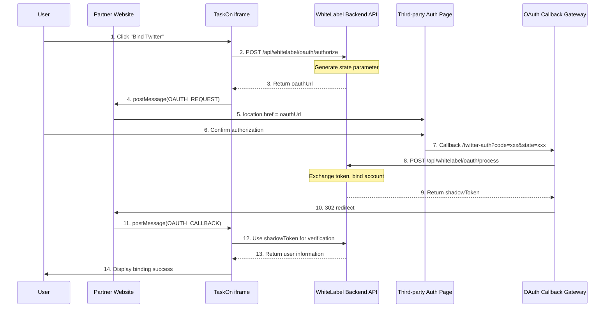
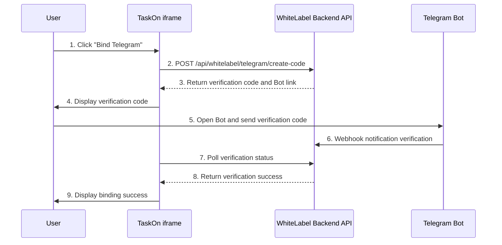
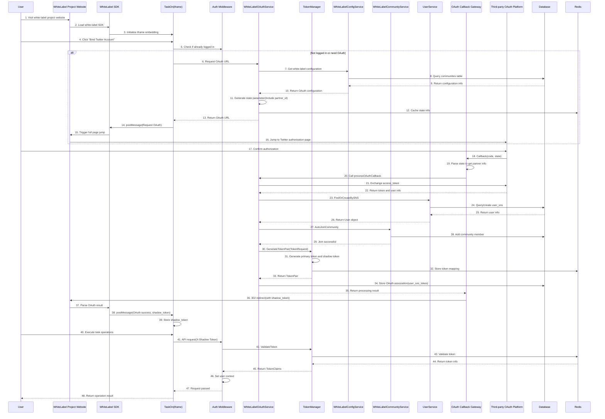
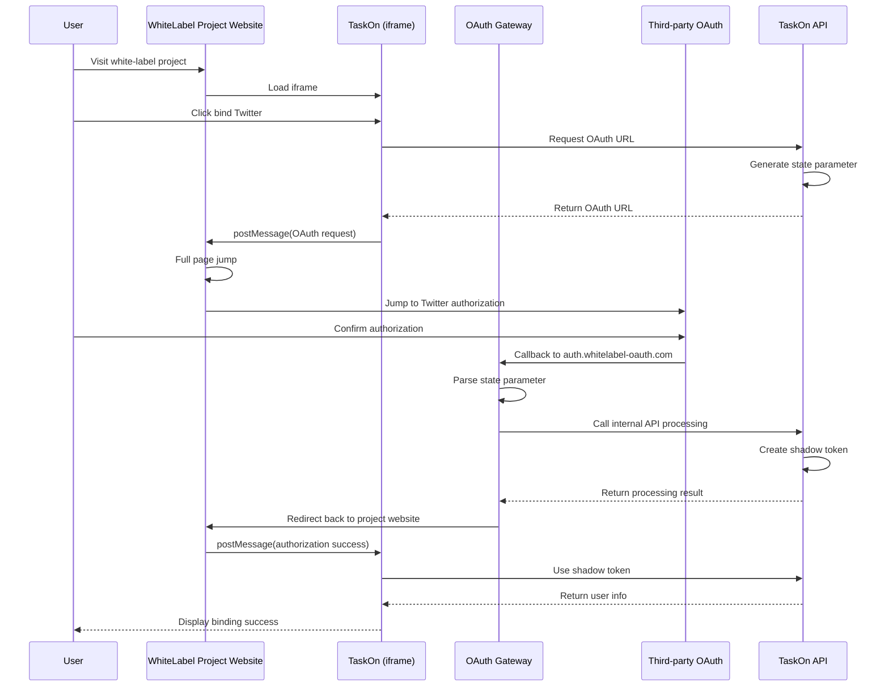

# WhiteLabel Third-Party OAuth Technical Solution

## I. Solution Overview

### 1.1 Core Objectives
Provide an independent third-party OAuth authorization system for white-label projects, completely isolated from TaskOn's existing OAuth system, implementing branded user authorization experience.

### 1.2 Key Decisions
- **Independent OAuth Application Suite**: All white-label projects share a new set of third-party applications (not TaskOn applications)
- **Independent Callback Domain**: Use `auth.whitelabel-oauth.com` to uniformly handle OAuth callbacks
- **Zero Fallback Strategy**: WhiteLabel OAuth failure cannot fallback to TaskOn OAuth (due to different ClientID and callback URLs)
- **Reuse Data Tables**: No new tables, reuse existing `communities`, `user_sns`, `user_sns_token` tables

### 1.3 Technical Architecture
```
User → Partner Website(iframe) → Third-Party Auth Page → auth.whitelabel-oauth.com → Partner Website → TaskOn iframe
```

## II. Core Component Design

### 2.1 OAuth Callback Gateway
**Project**: `taskon-oauth-gateway` (new)  
**Deployment**: `auth.whitelabel-oauth.com`  
**Responsibilities**: 
- Receive third-party platform OAuth callbacks
- Parse state parameters to identify projects
- Call white-label backend to complete OAuth processing
- 302 redirect to partner website

```go
// taskon-oauth-gateway/handlers/oauth_handler.go
package handlers

import (
    "encoding/json"
    "fmt"
    "net/http"
    "net/url"
    "github.com/gin-gonic/gin"
)

type StateData struct {
    PartnerID     int64  `json:"partner_id"`
    PartnerDomain string `json:"partner_domain"`
    Platform      string `json:"platform"`
    Timestamp     int64  `json:"timestamp"`
    Nonce         string `json:"nonce"`
}

// Twitter OAuth callback handler
func HandleTwitterCallback(c *gin.Context) {
    code := c.Query("code")
    state := c.Query("state")
    error := c.Query("error")
    
    // 1. Parse state parameter
    stateData, err := DecodeState(state)
    if err != nil {
        redirectError(c, stateData.PartnerDomain, "invalid_state")
        return
    }
    
    // 2. Handle error situations
    if error != "" {
        redirectError(c, stateData.PartnerDomain, error)
        return
    }
    
    // 3. Call white-label backend API to exchange token and handle OAuth
    resp, err := callWhiteLabelBackend("/api/whitelabel/oauth/process", map[string]interface{}{
        "platform":   "twitter",
        "code":       code,
        "state":      state,
        "partner_id": stateData.PartnerID,
    })
    
    if err != nil {
        redirectError(c, stateData.PartnerDomain, "backend_error")
        return
    }
    
    // 4. 302 redirect to partner website with shadowToken
    redirectURL := fmt.Sprintf("%s?oauth_status=success&oauth_token=%s&oauth_platform=twitter",
        stateData.PartnerDomain, resp.ShadowToken)
    c.Redirect(302, redirectURL)
}

// Discord OAuth callback handler
func HandleDiscordCallback(c *gin.Context) {
    // Similar to Twitter handling
}

// Telegram Bot verification special handling
func HandleTelegramCallback(c *gin.Context) {
    // Telegram uses different verification flow
    verifyCode := c.Query("code")
    state := c.Query("state")
    
    stateData, _ := DecodeState(state)
    
    // Call white-label backend to verify Telegram code
    resp, err := callWhiteLabelBackend("/api/whitelabel/telegram/verify", map[string]interface{}{
        "verify_code": verifyCode,
        "partner_id":  stateData.PartnerID,
    })
    
    if err != nil {
        redirectError(c, stateData.PartnerDomain, "telegram_verify_failed")
        return
    }
    
    redirectURL := fmt.Sprintf("%s?oauth_status=success&oauth_token=%s&oauth_platform=telegram",
        stateData.PartnerDomain, resp.ShadowToken)
    c.Redirect(302, redirectURL)
}
```

### 2.2 WhiteLabel Backend Module
**Project**: `taskon-server`  
**Location**: `service/whitlabel/`  
**Responsibilities**:
- OAuth configuration management
- State parameter generation and validation
- OAuth token exchange
- User account binding
- ShadowToken generation

```go
// taskon-server/service/whitlabel/oauth_service.go
package whitlabel

import (
    "encoding/base64"
    "encoding/json"
    "time"
    "github.com/google/uuid"
)

// WhiteLabel OAuth configuration (shared by all projects)
type WhiteLabelOAuthApps struct {
    TwitterConfig  *TwitterOAuthConfig  `json:"twitter_config"`
    DiscordConfig  *DiscordOAuthConfig  `json:"discord_config"`
    TelegramConfig *TelegramConfig      `json:"telegram_config"`
    RedditConfig   *RedditConfig        `json:"reddit_config"`
    EmailConfig    *EmailConfig         `json:"email_config"`
}

type WhiteLabelOAuthService struct {
    configManager *WhiteLabelConfigManager
    tokenManager  *TokenManager
    userService   *user.UserService
}

// Generate OAuth authorization URL (called by frontend)
func (s *WhiteLabelOAuthService) GenerateOAuthURL(partnerID int64, platform string) (string, error) {
    // 1. Get partner configuration
    partner := s.configManager.GetPartner(partnerID)
    if !partner.UseWhiteLabel {
        return "", errors.New("partner not enabled for white label")
    }
    
    // 2. Generate state parameter
    state := s.generateState(partnerID, partner.Domain, platform)
    
    // 3. Build OAuth URL based on platform
    switch platform {
    case "twitter":
        return s.buildTwitterOAuthURL(state)
    case "discord":
        return s.buildDiscordOAuthURL(state)
    case "telegram":
        return s.buildTelegramBotURL(state)
    case "reddit":
        return s.buildRedditOAuthURL(state)
    default:
        return "", errors.New("unsupported platform")
    }
}

// Process OAuth callback (called by OAuth gateway)
func (s *WhiteLabelOAuthService) ProcessOAuthCallback(platform, code, state string, partnerID int64) (*OAuthResult, error) {
    // 1. Validate state
    if !s.validateState(state, partnerID) {
        return nil, errors.New("invalid state")
    }
    
    // 2. Exchange token based on platform
    var userInfo *SocialUserInfo
    var err error
    
    switch platform {
    case "twitter":
        userInfo, err = s.exchangeTwitterToken(code)
    case "discord":
        userInfo, err = s.exchangeDiscordToken(code)
    case "reddit":
        userInfo, err = s.exchangeRedditToken(code)
    default:
        return nil, errors.New("unsupported platform")
    }
    
    if err != nil {
        return nil, err
    }
    
    // 3. Create or bind user
    userID, err := s.bindSocialAccount(partnerID, platform, userInfo)
    if err != nil {
        return nil, err
    }
    
    // 4. Generate shadowToken
    shadowToken := s.tokenManager.GenerateShadowToken(userID, partnerID)
    
    return &OAuthResult{
        ShadowToken: shadowToken,
        UserID:      userID,
        Platform:    platform,
    }, nil
}

// Generate state parameter
func (s *WhiteLabelOAuthService) generateState(partnerID int64, domain, platform string) string {
    stateData := StateData{
        PartnerID:     partnerID,
        PartnerDomain: domain,
        Platform:      platform,
        Timestamp:     time.Now().Unix(),
        Nonce:         uuid.New().String(),
    }
    
    data, _ := json.Marshal(stateData)
    return base64.URLEncoding.EncodeToString(data)
}

// Build Twitter OAuth URL
func (s *WhiteLabelOAuthService) buildTwitterOAuthURL(state string) (string, error) {
    config := s.configManager.GetWhiteLabelOAuthApps().TwitterConfig
    
    params := url.Values{}
    params.Set("response_type", "code")
    params.Set("client_id", config.ClientID)
    params.Set("redirect_uri", "https://auth.whitelabel-oauth.com/twitter-auth")
    params.Set("scope", "tweet.read users.read")
    params.Set("state", state)
    params.Set("code_challenge", "challenge")
    params.Set("code_challenge_method", "plain")
    
    return fmt.Sprintf("https://twitter.com/i/oauth2/authorize?%s", params.Encode()), nil
}

// Exchange Twitter token
func (s *WhiteLabelOAuthService) exchangeTwitterToken(code string) (*SocialUserInfo, error) {
    config := s.configManager.GetWhiteLabelOAuthApps().TwitterConfig
    
    // 1. Exchange access token
    tokenResp, err := s.callTwitterAPI("/oauth2/token", map[string]string{
        "grant_type":    "authorization_code",
        "code":          code,
        "redirect_uri":  "https://auth.whitelabel-oauth.com/twitter-auth",
        "client_id":     config.ClientID,
        "code_verifier": "challenge",
    })
    
    if err != nil {
        return nil, err
    }
    
    // 2. Get user information
    userInfo, err := s.callTwitterAPI("/2/users/me", nil, tokenResp.AccessToken)
    
    return &SocialUserInfo{
        ID:       userInfo.Data.ID,
        Username: userInfo.Data.Username,
        Name:     userInfo.Data.Name,
        Avatar:   userInfo.Data.ProfileImageURL,
    }, nil
}
```

### 2.3 Frontend Integration

#### Processing within iframe (TaskOn frontend)
```javascript
// taskon-website/apps/website/src/composables/useWhiteLabelOAuth.js
import { ref } from 'vue'
import { useWhiteLabelStore } from '@/store/whitelabel'

export const useWhiteLabelOAuth = () => {
    const isAuthenticating = ref(false)
    const whitelabelStore = useWhiteLabelStore()
    
    // Initialize OAuth authorization flow
    const initOAuth = async (platform) => {
        isAuthenticating.value = true
        
        try {
            // 1. Call white-label backend to get OAuth URL
            const { oauthUrl } = await fetch('/api/whitelabel/oauth/authorize', {
                method: 'POST',
                headers: {
                    'Content-Type': 'application/json',
                    'X-Partner-ID': whitelabelStore.partnerID
                },
                body: JSON.stringify({ platform })
            }).then(r => r.json())
            
            // 2. Notify parent page to perform full-page jump
            window.parent.postMessage({
                type: 'WHITELABEL_OAUTH_REQUEST',
                platform: platform,
                oauthUrl: oauthUrl
            }, '*')
            
            // 3. Wait for OAuth result
            return new Promise((resolve, reject) => {
                const timeout = setTimeout(() => {
                    reject(new Error('OAuth timeout'))
                }, 5 * 60 * 1000) // 5 minute timeout
                
                const handleMessage = (event) => {
                    if (event.data.type === 'WHITELABEL_OAUTH_CALLBACK') {
                        clearTimeout(timeout)
                        window.removeEventListener('message', handleMessage)
                        
                        if (event.data.status === 'success') {
                            // 4. Login with shadowToken
                            whitelabelStore.setShadowToken(event.data.token)
                            resolve(event.data)
                        } else {
                            reject(new Error(event.data.error || 'OAuth failed'))
                        }
                    }
                }
                
                window.addEventListener('message', handleMessage)
            })
        } finally {
            isAuthenticating.value = false
        }
    }
    
    // Telegram special handling (Bot verification)
    const initTelegramAuth = async () => {
        // 1. Get verification code
        const { verifyCode, botUrl } = await fetch('/api/whitelabel/telegram/create-code', {
            method: 'POST',
            headers: {
                'X-Partner-ID': whitelabelStore.partnerID
            }
        }).then(r => r.json())
        
        // 2. Display verification code and Bot link
        return {
            verifyCode,
            botUrl, // https://t.me/WhiteLabel_OAuth_Bot
            // 3. Poll verification status
            checkStatus: () => pollTelegramStatus(verifyCode)
        }
    }
    
    return {
        initOAuth,
        initTelegramAuth,
        isAuthenticating
    }
}
```

#### Partner Website Integration (Simple JavaScript)
```html
<!-- Partner website index.html -->
<script>
(function() {
    // OAuth callback handling
    function handleOAuthCallback() {
        const params = new URLSearchParams(window.location.search)
        const oauthStatus = params.get('oauth_status')
        
        if (oauthStatus) {
            // Find TaskOn iframe and send OAuth result
            const iframe = document.querySelector('#taskon-iframe')
            if (iframe && iframe.contentWindow) {
                iframe.contentWindow.postMessage({
                    type: 'WHITELABEL_OAUTH_CALLBACK',
                    status: oauthStatus,
                    token: params.get('oauth_token'),
                    platform: params.get('oauth_platform'),
                    error: params.get('oauth_error')
                }, 'https://whitelabel.taskon.xyz')
            }
            
            // Clean URL parameters
            const cleanUrl = window.location.origin + window.location.pathname
            window.history.replaceState({}, document.title, cleanUrl)
        }
    }
    
    // OAuth request handling
    function handleOAuthRequest(event) {
        // Verify message origin
        if (event.origin !== 'https://whitelabel.taskon.xyz') return
        
        if (event.data.type === 'WHITELABEL_OAUTH_REQUEST') {
            // Save current state (optional)
            sessionStorage.setItem('pre_oauth_state', JSON.stringify({
                scrollY: window.scrollY,
                timestamp: Date.now()
            }))
            
            // Full page jump to OAuth authorization page
            window.location.href = event.data.oauthUrl
        }
    }
    
    // Initialization
    window.addEventListener('DOMContentLoaded', handleOAuthCallback)
    window.addEventListener('message', handleOAuthRequest)
})();
</script>

<!-- TaskOn iframe embedding -->
<iframe 
    id="taskon-iframe"
    src="https://whitelabel.taskon.xyz/community/5001"
    width="100%"
    height="800"
    frameborder="0">
</iframe>
```

## III. Integration with Existing WhiteLabel Solution

### 3.1 Reusing Existing Components

This OAuth solution is based on the existing white-label technical solution and reuses the following core components:

1. **TokenManager (Token Manager)**
   - Location: `taskon-server/token/manager.go`
   - Function: Dual token mechanism (PrimaryToken + ShadowToken)
   - Reuse Method: Call `GenerateTokenPair` to generate token pairs after OAuth success

2. **WhiteLabelConfigService (Config Service)**
   - Location: `taskon-server/service/whitelabel_config.go`
   - Function: Manage white-label project configurations
   - Reuse Method: Get project OAuth configuration, validate partner_id

3. **WhiteLabelCommunityService (Community Service)**
   - Location: `taskon-server/service/whitelabel_community.go`
   - Function: Automatically join community
   - Reuse Method: Call `AutoJoinCommunity` after OAuth login

4. **Authentication Middleware**
   - Location: `taskon-server/middleware/auth.go`
   - Function: Support shadow token authentication
   - Reuse Method: Already supports `X-Shadow-Token` header validation

### 3.2 New OAuth-Specific Components

1. **OAuth Callback Gateway** (New project)
   - Project Name: taskon-oauth-gateway
   - Independent deployment service
   - Handle all OAuth callbacks

2. **WhiteLabelOAuthService** (New service)
   - Location: `taskon-server/service/whitelabel_oauth.go`
   - Integrate existing components
   - Handle OAuth specific logic

### 3.3 Technical Link Connectivity

```
WhiteLabel Project → OAuth Request → taskon-server(generate state) → Third-party OAuth
    ↓
OAuth Callback Gateway ← OAuth Callback ← Third-party OAuth
    ↓
taskon-server(TokenManager generate tokens) → Return shadow token
    ↓
WhiteLabel Project uses shadow token → taskon-server auth middleware validation → Access API
```

## IV. Configuration File Examples

### 4.1 taskon-server Configuration (config.json)
```json
{
  // Existing TaskOn OAuth configuration remains unchanged
  "twitterOAuth": {
    "client_id": "aTk5eEUxZlpvak1RYU9yTEZhZ0M6MTpjaQ",
    "redirect_url": ["https://testtaskonweb.taskon.xyz/twitter"]
  },
  
  // New white-label OAuth configuration
  "WhiteLabelOAuthApps": {
    "TwitterConfig": {
      "ClientId": "whitelabel_twitter_client_id_xxx",
      "ClientSecret": "whitelabel_twitter_client_secret_xxx",
      "AuthCode": "Basic base64_encoded_credentials",
      "RedirectURL": ["https://auth.whitelabel-oauth.com/twitter-auth"]
    },
    "DiscordConfig": {
      "ClientId": "whitelabel_discord_client_id",
      "ClientSecret": "whitelabel_discord_client_secret",
      "RedirectURL": "https://auth.whitelabel-oauth.com/discord-auth"
    },
    "TelegramConfig": {
      "BotToken": "whitelabel_telegram_bot_token",
      "BotUsername": "WhiteLabel_OAuth_Bot",
      "LoginServerHost": "http://telegram-verify.whitelabel.com",
      "CreateLoginCodeURL": "/v1/telegram/create_code",
      "GetLoginInfoURL": "/v1/telegram/info"
    },
    "RedditConfig": {
      "ClientId": "whitelabel_reddit_client_id",
      "ClientSecret": "whitelabel_reddit_client_secret",
      "RedirectUri": "https://auth.whitelabel-oauth.com/reddit-auth"
    },
    "EmailConfig": {
      "SMTPHost": "smtp.sendgrid.net",
      "SMTPPort": 587,
      "SMTPUser": "apikey",
      "SMTPPassword": "sendgrid_api_key",
      "FromEmail": "noreply@whitelabel.com"
    }
  },
  
  // White-label partner configuration
  "WhiteLabelPartners": [
    {
      "partner_id": 1001,
      "partner_name": "Partner Alpha",
      "partner_domain": "https://alpha.example.com",
      "community_id": 5001,
      "use_whitelabel": true,
      "enabled": true
    },
    {
      "partner_id": 1002,
      "partner_name": "Partner Beta",
      "partner_domain": "https://beta.example.com",
      "community_id": 5002,
      "use_whitelabel": true,
      "enabled": true
    }
  ]
}
```

### 4.2 OAuth Callback Gateway Configuration (taskon-oauth-gateway/config.json)
```json
{
  "server": {
    "port": 8080,
    "domain": "https://auth.whitelabel-oauth.com"
  },
  "backend": {
    "whitelabel_api": "https://api.taskon.xyz",
    "api_key": "internal_api_key_for_security"
  },
  "redis": {
    "host": "redis.internal.taskon.xyz",
    "port": 6379,
    "db": 2,
    "password": "redis_password"
  },
  "security": {
    "state_expire_seconds": 600,
    "allowed_origins": [
      "https://alpha.example.com",
      "https://beta.example.com"
    ]
  }
}
```

## IV. OAuth Flow Sequence Diagrams

### 4.1 Standard OAuth Flow (Twitter/Discord/Reddit)


### 4.2 Telegram Bot Verification Flow


## V. API Interface Definitions

### 5.1 WhiteLabel OAuth API

#### 1. Get OAuth Authorization URL

**Interface Definition**
```
POST /api/whitelabel/oauth/authorize
```

**Request Headers**
```json
{
  "X-Partner-ID": "1001"
}
```

**Request Body**
```json
{
  "platform": "twitter"  // Options: twitter | discord | reddit
}
```

**Response Example**
```json
{
  "oauth_url": "https://twitter.com/i/oauth2/authorize?..."
}
```

---

#### 2. Process OAuth Callback (Internal API)

**Interface Definition**
```
POST /api/whitelabel/oauth/process
```

**Note**: This interface is only for internal OAuth gateway calls

**Request Headers**
```json
{
  "X-API-Key": "internal_api_key"
}
```

**Request Body**
```json
{
  "platform": "twitter",
  "code": "oauth_code",
  "state": "encoded_state",
  "partner_id": 1001
}
```

**Response Example**
```json
{
  "shadow_token": "xxx",
  "user_id": 123
}
```

---

#### 3. Telegram Verification Code Generation

**Interface Definition**
```
POST /api/whitelabel/telegram/create-code
```

**Request Headers**
```json
{
  "X-Partner-ID": "1001"
}
```

**Response Example**
```json
{
  "verify_code": "123456",
  "bot_url": "https://t.me/WhiteLabel_OAuth_Bot"
}
```

---

#### 4. Email Verification Code Sending

**Interface Definition**
```
POST /api/whitelabel/email/send-code
```

**Request Headers**
```json
{
  "X-Partner-ID": "1001"
}
```

**Request Body**
```json
{
  "email": "user@example.com"
}
```

**Response Example**
```json
{
  "success": true
}
```

## VI. Key Implementation Details

### 6.1 State Parameter Security
```go
// State parameter encryption and validation
func (s *WhiteLabelOAuthService) validateState(state string, expectedPartnerID int64) bool {
    // 1. Base64 decode
    data, err := base64.URLEncoding.DecodeString(state)
    if err != nil {
        return false
    }
    
    // 2. JSON parsing
    var stateData StateData
    if err := json.Unmarshal(data, &stateData); err != nil {
        return false
    }
    
    // 3. Validate partner_id match
    if stateData.PartnerID != expectedPartnerID {
        return false
    }
    
    // 4. Validate timestamp (10 minute validity)
    if time.Now().Unix()-stateData.Timestamp > 600 {
        return false
    }
    
    // 5. Validate nonce anti-replay (Redis check)
    if s.redis.Exists(fmt.Sprintf("oauth_nonce:%s", stateData.Nonce)) {
        return false
    }
    
    // 6. Mark nonce as used
    s.redis.Set(fmt.Sprintf("oauth_nonce:%s", stateData.Nonce), "1", 600)
    
    return true
}
```

### 6.2 Integration with Existing TokenManager

**Important Note**: Reuse the existing TokenManager component from the white-label technical solution, do not reimplement.

```go
// Reuse existing TokenManager (from taskon-server/token/manager.go)
import "taskon-server/token"

// WhiteLabelOAuthService integrates existing TokenManager
type WhiteLabelOAuthService struct {
    tokenManager *token.TokenManager     // Reuse existing token manager
    configSvc    *WhiteLabelConfigService // Reuse existing config service
    userSvc      UserService
    redis        *redis.Client
}

// Process OAuth callback and generate token pair
func (s *WhiteLabelOAuthService) processOAuthCallback(
    platform string, 
    code string, 
    stateData *StateData,
) (*OAuthResponse, error) {
    // 1. Exchange OAuth token to get user info
    oauthToken, userInfo, err := s.exchangeOAuthToken(platform, code)
    if err != nil {
        return nil, err
    }
    
    // 2. Find or create user
    user, err := s.userSvc.FindOrCreateBySNS(platform, userInfo)
    if err != nil {
        return nil, err
    }
    
    // 3. Build token request, reuse existing TokenRequest structure
    tokenReq := &token.TokenRequest{
        UserID:         user.ID,
        DID:            user.DID,
        IsWhiteLabel:   true,
        IsExistingUser: user.CreatedAt.Before(time.Now().Add(-24*time.Hour)),
        UserEmail:      user.Email,
        LoginMethod:    "oauth_" + platform,
        Domain:         stateData.PartnerDomain,
        CommunityID:    strconv.FormatInt(stateData.PartnerID, 10),
    }
    
    // 4. Use existing TokenManager to generate dual tokens
    tokenPair, err := s.tokenManager.GenerateTokenPair(tokenReq)
    if err != nil {
        return nil, err
    }
    
    // 5. Return OAuth response, use shadow token
    return &OAuthResponse{
        ShadowToken:  tokenPair.ShadowToken,  // WhiteLabel projects use shadow token
        UserID:       user.ID,
        RefreshToken: tokenPair.RefreshToken,
        ExpiresAt:    tokenPair.ExpiresAt,
    }, nil
}

// Validate shadow token (reuse existing TokenManager ValidateToken method)
func (s *WhiteLabelOAuthService) validateShadowToken(shadowToken string) (*token.TokenClaims, error) {
    return s.tokenManager.ValidateToken(shadowToken)
}

// OAuth token exchange specific implementation (based on different platforms)
func (s *WhiteLabelOAuthService) exchangeOAuthToken(platform, code string) (string, *SNSUserInfo, error) {
    switch platform {
    case "twitter":
        return s.exchangeTwitterToken(code)
    case "discord":
        return s.exchangeDiscordToken(code)
    case "reddit":
        return s.exchangeRedditToken(code)
    default:
        return "", nil, fmt.Errorf("unsupported platform: %s", platform)
    }
}

// SNSUserInfo unified user information structure
type SNSUserInfo struct {
    Platform   string `json:"platform"`
    UserID     string `json:"user_id"`
    Username   string `json:"username"`
    Email      string `json:"email,omitempty"`
    Avatar     string `json:"avatar,omitempty"`
    Verified   bool   `json:"verified"`
}
```

### 6.3 Error Handling
```go
// OAuth gateway error handling
func redirectError(c *gin.Context, partnerDomain, errorType string) {
    errorMessages := map[string]string{
        "invalid_state":    "Authorization state invalid",
        "access_denied":    "User denied authorization",
        "backend_error":    "Backend processing failed",
        "token_exchange":   "Token exchange failed",
    }
    
    msg := errorMessages[errorType]
    if msg == "" {
        msg = "Unknown error"
    }
    
    redirectURL := fmt.Sprintf("%s?oauth_status=error&oauth_error=%s&oauth_message=%s",
        partnerDomain, errorType, url.QueryEscape(msg))
    c.Redirect(302, redirectURL)
}
```

## VII. Database Changes Description

### 7.1 Data Table Reuse Strategy

**Core Principle**: Maximize reuse of existing table structures, minimize database changes.

#### Reused Existing Tables

1. **user_sns table** - Complete reuse
   ```sql
   -- Existing table structure, no modification needed
   CREATE TABLE `user_sns` (
     `id` int(11) NOT NULL AUTO_INCREMENT,
     `user_id` int(11) NOT NULL,
     `sns_type` varchar(32) NOT NULL,  -- Supports twitter/discord/telegram/reddit
     `sns_id` varchar(64) NOT NULL,
     `sns_user_name` varchar(64) NOT NULL,
     `sns_avatar` varchar(1024) NOT NULL,
     PRIMARY KEY (`id`),
     UNIQUE KEY `uni_userid_snstype_snsid` (`sns_type`,`sns_id`)
   );
   ```
   - WhiteLabel OAuth login user information stored in this table
   - Differentiate platforms by sns_type

2. **user_sns_tokens table** - Complete reuse
   ```sql
   -- Existing table structure, no modification needed
   CREATE TABLE `user_sns_tokens` (
     `id` int(11) NOT NULL AUTO_INCREMENT,
     `sns_id` varchar(100) NOT NULL,
     `sns_type` varchar(100) NOT NULL,
     `token` varchar(1024) NOT NULL,       -- OAuth access_token
     `refresh_token` varchar(1024) NOT NULL,
     `expires_in` int(11) NOT NULL,
     `expire_time` int(11) NOT NULL,
     PRIMARY KEY (`id`),
     UNIQUE KEY `uni_snstype_snsid` (`sns_type`,`sns_id`)
   );
   ```
   - Store OAuth token information
   - Both white-label and TaskOn OAuth tokens stored here

3. **users table** - Complete reuse
   - User basic information table, no modification needed
   - Shared by white-label users and TaskOn users

#### Tables Need Modification

1. **communities table** - Add white-label OAuth configuration fields
   ```sql
   ALTER TABLE `communities` 
   ADD COLUMN `use_whitelabel_oauth` TINYINT(1) DEFAULT 0 
     COMMENT 'Whether to use white-label OAuth: 0-Use TaskOn OAuth, 1-Use white-label OAuth' AFTER `visible`,
   ADD COLUMN `whitelabel_oauth_config` JSON DEFAULT NULL 
     COMMENT 'White-label OAuth configuration information' AFTER `use_whitelabel_oauth`;
   ```

   Configuration JSON example:
   ```json
   {
     "partner_id": 1001,
     "partner_domain": "project1.com",
     "enabled_platforms": ["twitter", "discord", "telegram"],
     "auto_join": true,
     "created_at": "2024-01-01T00:00:00Z"
   }
   ```

#### New Tables Needed (from white-label technical solution)

1. **whitelabel_configs table** - White-label configuration main table
   ```sql
   CREATE TABLE IF NOT EXISTS `whitelabel_configs` (
     `id` BIGINT NOT NULL AUTO_INCREMENT,
     `partner_domain` VARCHAR(255) NOT NULL COMMENT 'Partner domain',
     `community_id` BIGINT NOT NULL COMMENT 'Associated community ID',
     `config_json` JSON NOT NULL COMMENT 'Configuration details',
     `auto_join` TINYINT(1) DEFAULT 1 COMMENT 'Auto join community',
     `status` TINYINT DEFAULT 1 COMMENT 'Status: 0-Disabled, 1-Enabled',
     `created_at` TIMESTAMP DEFAULT CURRENT_TIMESTAMP,
     `updated_at` TIMESTAMP DEFAULT CURRENT_TIMESTAMP ON UPDATE CURRENT_TIMESTAMP,
     PRIMARY KEY (`id`),
     UNIQUE KEY `uk_domain` (`partner_domain`),
     KEY `idx_community` (`community_id`)
   ) ENGINE=InnoDB DEFAULT CHARSET=utf8mb4 COMMENT='White-label configuration table';
   ```

2. **token_pairs table** - Token pair mapping (from white-label technical solution)
   ```sql
   CREATE TABLE IF NOT EXISTS `token_pairs` (
     `id` BIGINT NOT NULL AUTO_INCREMENT,
     `pair_id` VARCHAR(64) NOT NULL COMMENT 'Token pair ID',
     `user_id` BIGINT NOT NULL COMMENT 'User ID',
     `primary_token_hash` VARCHAR(255) NOT NULL COMMENT 'Primary token hash',
     `shadow_token_hash` VARCHAR(255) NOT NULL COMMENT 'Shadow token hash',
     `refresh_token_hash` VARCHAR(255) COMMENT 'Refresh token hash',
     `expires_at` TIMESTAMP NOT NULL COMMENT 'Expiration time',
     `created_at` TIMESTAMP DEFAULT CURRENT_TIMESTAMP,
     PRIMARY KEY (`id`),
     UNIQUE KEY `uk_pair_id` (`pair_id`),
     KEY `idx_primary_token` (`primary_token_hash`),
     KEY `idx_shadow_token` (`shadow_token_hash`),
     KEY `idx_user_expires` (`user_id`, `expires_at`)
   ) ENGINE=InnoDB DEFAULT CHARSET=utf8mb4 COMMENT='Token pair mapping table';
   ```

### 7.2 Database Changes Summary

| Operation Type | Table Name | Changes | Impact Scope |
|---------|------|---------|----------|
| Reuse | user_sns | No modification needed | None |
| Reuse | user_sns_tokens | No modification needed | None |
| Reuse | users | No modification needed | None |
| Modify | communities | Add 2 fields | Low risk, backward compatible |
| New | whitelabel_configs | New table | No impact |
| New | token_pairs | New table | No impact |

### 7.3 Data Migration Strategy

1. **Tables not requiring data migration**
   - user_sns, user_sns_tokens, users tables continue normal use
   - New white-label OAuth data naturally written

2. **communities table upgrade**
   - Default value is 0, no impact on existing communities
   - Only explicitly configured communities enable white-label OAuth

3. **New table initialization**
   - whitelabel_configs and token_pairs tables created directly
   - No historical data needs migration

## VIII. Implementation Steps

### Phase 1: Infrastructure
1. **Apply for third-party OAuth applications**
   - [ ] Twitter developer account application
   - [ ] Discord application creation
   - [ ] Telegram Bot creation
   - [ ] Reddit application application
   - [ ] SendGrid/SES configuration

2. **Deploy OAuth callback gateway**
   - [ ] Domain configuration: auth.whitelabel-oauth.com
   - [ ] SSL certificate configuration
   - [ ] Create taskon-oauth-gateway project
   - [ ] Deploy to cloud server

### Phase 2: Backend Development
1. **White-label module development**
   - [ ] WhiteLabelOAuthService implementation (new)
   - [ ] Integrate existing TokenManager
   - [ ] Integrate existing WhiteLabelConfigService
   - [ ] API route addition

2. **Database adjustments**
   - [ ] Add white-label OAuth configuration fields to communities table
   - [ ] Configuration file updates

### Phase 3: Frontend Integration
1. **TaskOn frontend modifications**
   - [ ] useWhiteLabelOAuth Hook development
   - [ ] White-label Store implementation
   - [ ] postMessage communication logic

2. **Partner integration documentation**
   - [ ] JavaScript integration code
   - [ ] Integration guide documentation
   - [ ] Example project

### Phase 4: Platform Gradual Integration
1. **Phased testing**
   - [ ] Email verification code (simplest)
   - [ ] Twitter OAuth
   - [ ] Discord OAuth
   - [ ] Telegram Bot
   - [ ] Reddit OAuth

### Phase 5: Production Deployment
1. **Deployment and monitoring**
   - [ ] Production environment deployment
   - [ ] Monitoring alert configuration
   - [ ] Performance optimization
   - [ ] Documentation completion

## VIII. Complete Technical Link Sequence Diagram

### 8.1 OAuth Authentication Complete Flow (Integrating Existing WhiteLabel Components)



## IX. Deployment Architecture Diagram

### 9.1 Comprehensive Deployment Architecture (WhiteLabel Solution + OAuth Extension)

```mermaid
graph TB
    subgraph "Third-party Platforms"
        subgraph "OAuth Platforms"
            Twitter[Twitter/X OAuth]
            Discord[Discord OAuth]
            Reddit[Reddit OAuth]
        end
        subgraph "Other Platforms"
            Telegram[Telegram Bot]
            Email[Email Service<br/>SendGrid/SES]
        end
    end
    
    subgraph "WhiteLabel Project Domain Group"
        subgraph "Partner Websites"
            Project1[project1.com]
            Project2[project2.com]
            ProjectN[More projects...]
        end
        subgraph "Partner Services"
            PS1[Partner Server 1]
            PS2[Partner Server 2]
            PSN[Partner Server N]
        end
    end
    
    subgraph "CDN Layer"
        SDK[WhiteLabel SDK<br/>taskon-whitelabel-sdk.js]
        IframeContent[iframe page resources]
    end
    
    subgraph "OAuth Callback Gateway<br/>auth.whitelabel-oauth.com"
        Nginx1[Nginx Reverse Proxy<br/>SSL Termination]
        Gateway[taskon-oauth-gateway<br/>Independent Deployment Service]
        Nginx1 --> Gateway
    end
    
    subgraph "TaskOn Core Services"
        subgraph "API Gateway Layer"
            ALB[Load Balancer<br/>AWS ALB/Nginx]
            APIGateway[API Gateway<br/>Route Distribution]
            ALB --> APIGateway
        end
        
        subgraph "Application Service Layer"
            subgraph "taskon-server Cluster"
                Server1[Server Instance 1]
                Server2[Server Instance 2]
                Server3[Server Instance 3]
            end
            
            subgraph "WhiteLabel Core Components"
                TokenManager[TokenManager<br/>Token Manager]
                WLConfig[WhiteLabelConfigService<br/>Config Service]
                WLCommunity[WhiteLabelCommunityService<br/>Community Service]
                WLOAuth[WhiteLabelOAuthService<br/>OAuth Service]
                AuthMiddleware[Auth Middleware<br/>Shadow Token Support]
            end
            
            subgraph "Business Services"
                UserService[User Service]
                CommunityService[Community Service]
                TaskService[Task Service]
            end
        end
        
        APIGateway --> Server1
        APIGateway --> Server2
        APIGateway --> Server3
        
        Server1 --> TokenManager
        Server1 --> WLConfig
        Server1 --> WLCommunity
        Server1 --> WLOAuth
        Server1 --> AuthMiddleware
        
        WLOAuth --> UserService
        WLCommunity --> CommunityService
    end
    
    subgraph "Data Storage Layer"
        subgraph "Relational Database"
            MySQL_Master[(MySQL Master)]
            MySQL_Slave1[(MySQL Slave 1)]
            MySQL_Slave2[(MySQL Slave 2)]
            MySQL_Master -.Master-Slave Replication.-> MySQL_Slave1
            MySQL_Master -.Master-Slave Replication.-> MySQL_Slave2
        end
        
        subgraph "Cache Layer"
            Redis_Cluster[(Redis Cluster<br/>3 Masters 3 Slaves)]
        end
        
        subgraph "Configuration Center"
            ETCD[(ETCD Cluster)]
        end
    end
    
    %% WhiteLabel SDK loading flow
    Project1 -.Load SDK.-> SDK
    Project2 -.Load SDK.-> SDK
    ProjectN -.Load SDK.-> SDK
    
    %% iframe embedding flow
    SDK -.Load iframe.-> IframeContent
    IframeContent -.Render.-> Project1
    IframeContent -.Render.-> Project2
    
    %% Partner login flow
    PS1 ==Login Request==> APIGateway
    PS2 ==Login Request==> APIGateway
    
    %% OAuth flow
    Project1 ==OAuth Request==> Gateway
    Gateway ==Exchange Token==> Twitter
    Gateway ==Exchange Token==> Discord
    Gateway ==Exchange Token==> Reddit
    Gateway ==Verification Code==> Telegram
    Gateway ==Send Email==> Email
    
    %% OAuth callback handling
    Twitter --Callback--> Nginx1
    Discord --Callback--> Nginx1
    Reddit --Callback--> Nginx1
    
    Gateway ==Internal API==> APIGateway
    
    %% Data access
    TokenManager --> Redis_Cluster
    WLConfig --> MySQL_Master
    WLCommunity --> MySQL_Master
    WLOAuth --> MySQL_Master
    UserService --> MySQL_Slave1
    CommunityService --> MySQL_Slave2
    AuthMiddleware --> Redis_Cluster
    WLConfig --> ETCD
    
    classDef oauth fill:#e1f5fe,stroke:#01579b,stroke-width:2px
    classDef whitelabel fill:#f3e5f5,stroke:#4a148c,stroke-width:2px
    classDef gateway fill:#fff3e0,stroke:#e65100,stroke-width:2px
    classDef taskon fill:#e8f5e9,stroke:#1b5e20,stroke-width:2px
    classDef storage fill:#fce4ec,stroke:#880e4f,stroke-width:2px
    classDef cdn fill:#f0f4c3,stroke:#827717,stroke-width:2px
    classDef component fill:#e0f2f1,stroke:#004d40,stroke-width:2px
    
    class Twitter,Discord,Reddit,Telegram,Email oauth
    class Project1,Project2,ProjectN,PS1,PS2,PSN whitelabel
    class Gateway,Nginx1 gateway
    class ALB,APIGateway,Server1,Server2,Server3 taskon
    class MySQL_Master,MySQL_Slave1,MySQL_Slave2,Redis_Cluster,ETCD storage
    class SDK,IframeContent cdn
    class TokenManager,WLConfig,WLCommunity,WLOAuth,AuthMiddleware component
```



### 9.2 Data Flow Diagram



### 9.3 Deployment Instructions

#### OAuth Callback Gateway Deployment
- **Domain**: auth.whitelabel-oauth.com
- **Server**: Independent cloud server (AWS EC2/Alibaba Cloud ECS)
- **Configuration**: 2-core 4GB memory, 50GB SSD
- **Software Stack**: 
  - Nginx (reverse proxy + SSL termination)
  - Node.js/Go Service
  - PM2/Supervisor (process management)
- **Network**: Public IP, firewall only open port 443

#### TaskOn Main Service Deployment
- **Deployment Method**: Kubernetes/Docker Swarm cluster
- **Instance Count**: Minimum 3 instances for high availability
- **Load Balancing**: Nginx/AWS ALB
- **Service Discovery**: Consul/Kubernetes Service
- **Configuration Management**: ConfigMap/ETCD

#### Data Layer Deployment
- **MySQL**: Master-slave replication, read-write separation
- **Redis**: Cluster mode, 3 masters 3 slaves
- **Monitoring**: Prometheus + Grafana

### 9.4 Network and Security Configuration

```yaml
# Firewall rules
oauth_gateway:
  inbound:
    - 443/tcp from 0.0.0.0/0  # HTTPS public access
  outbound:
    - 443/tcp to third_party_oauth  # OAuth platforms
    - 8080/tcp to taskon_internal   # Internal API

taskon_server:
  inbound:
    - 8080/tcp from oauth_gateway   # Internal API
    - 8080/tcp from load_balancer   # User requests
  outbound:
    - 3306/tcp to mysql_cluster
    - 6379/tcp to redis_cluster
```

## X. Monitoring and Alerts

### 10.1 Key Metrics Monitoring
```yaml
# Prometheus metrics
whitelabel_oauth_requests_total{platform, status}
whitelabel_oauth_duration_seconds{platform}
whitelabel_shadow_token_validations_total{status}
whitelabel_partner_requests_total{partner_id}
```

### 10.2 Logging
```go
// Structured logging
logger.Info("OAuth request initiated",
    zap.String("platform", platform),
    zap.Int64("partner_id", partnerID),
    zap.String("request_id", requestID))

logger.Error("OAuth failed",
    zap.String("platform", platform),
    zap.Int64("partner_id", partnerID),
    zap.Error(err))
```

## XI. Security Measures

1. **State Parameter Protection**
   - Include timestamp to prevent expiration
   - Nonce to prevent replay attacks
   - Partner ID verification

2. **Token Security**
   - JWT signature verification
   - Redis double verification
   - 24-hour automatic expiration

3. **Domain Whitelist**
   - Strict CORS restrictions
   - Referrer checking
   - Origin verification

4. **Rate Limiting**
   ```go
   // Rate limiting configuration
   rateLimiter := rate.NewLimiter(10, 100) // 10 requests per second, burst 100
   ```

## XII. Troubleshooting

### 12.1 Common Issue Troubleshooting
| Issue | Cause | Solution |
|------|------|----------|
| State validation failed | Timeout or duplicate use | Re-initiate OAuth |
| Token exchange failed | ClientSecret error | Check configuration |
| Redirect failed | Domain mismatch | Check whitelist |
| Telegram verification failed | Bot configuration error | Check Bot Token |

### 10.2 Fallback Solutions
Although cannot fallback to TaskOn OAuth, we can:
1. Display friendly error messages
2. Provide retry button
3. Log detailed information for troubleshooting

## Summary

This solution implements fully branded OAuth experience for white-label projects through independent OAuth callback gateway and white-label modules. Key features:

1. **Complete Isolation**: Independent OAuth applications, independent callback domains, independent processing logic
2. **Secure and Reliable**: State parameter validation, token double verification, domain whitelist
3. **Simple Integration**: Partners only need minimal JavaScript code
4. **Easy Maintenance**: Modular design, detailed logging, monitoring alerts

By strictly following this document implementation, white-label third-party OAuth authorization can be ensured to work properly.