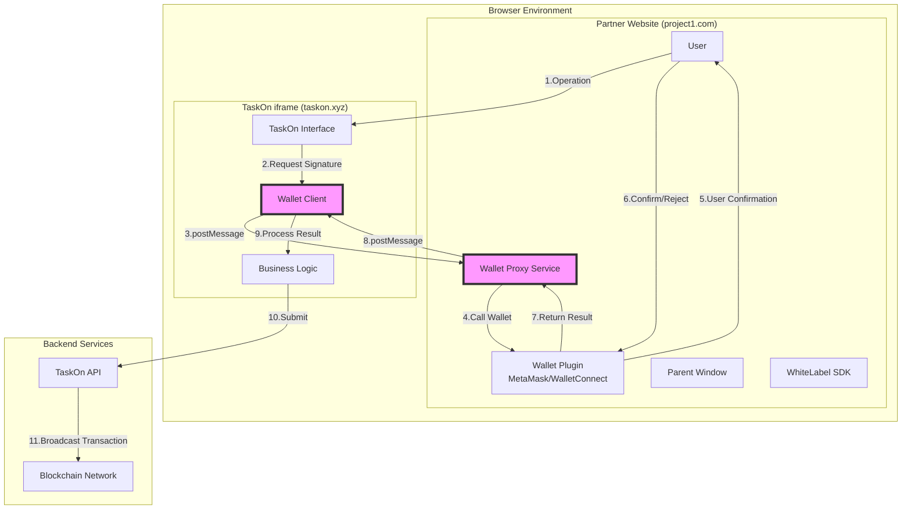
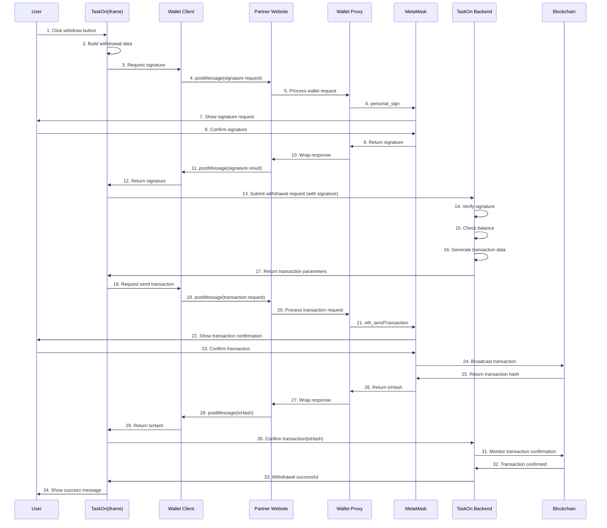

# WhiteLabel iframe Wallet Signature Technical Solution

## I. Problem Background

### 1.1 Technical Challenges

In the white-label architecture, TaskOn frontend code (taskon-website) is embedded into partner websites through iframe. When users need to perform operations requiring wallet signatures (such as withdrawals, transfers, etc.), the following technical challenges arise:

1. **iframe Security Restrictions**: Browser security policies prohibit iframes from directly accessing parent window objects
2. **Wallet Plugin Restrictions**: Wallet plugins like MetaMask only inject the `window.ethereum` object in the top-level window (top window)
3. **Cross-Domain Restrictions**: TaskOn (taskon.xyz) and partner websites (such as project1.com) belong to different domains

### 1.2 Supported Wallet Types

Based on wallets currently supported by TaskOn, this solution needs to be compatible with all the following wallet types:

#### EVM Compatible Wallets (Ethereum/BSC/Polygon etc.)
- **MetaMask** - Browser plugin, most widely used
- **WalletConnect** - Protocol standard, supports mobile
- **Bitget Wallet** - Multi-chain wallet
- **OKX Wallet** - OKX exchange wallet
- **Binance Wallet** - Binance Web3 wallet
- **Braavos** - StarkNet wallet

#### Non-EVM Chain Wallets
- **TonConnect** - TON blockchain
- **TronLink** - TRON blockchain  
- **OKX Wallet BTC** - Bitcoin wallet
- **Phantom** - Solana mainstream wallet
- **Unisat** - Bitcoin Ordinals wallet
- **FSL ID** - STEPN ecosystem wallet
- **ONTO** - Multi-chain wallet
- **Petra Aptos** - Aptos blockchain
- **Slush** - Wallet aggregator
- **Suiet** - Sui blockchain
- **Martian** - Aptos/Sui wallet
- **Leap** - Cosmos ecosystem wallet

### 1.3 Scenarios Requiring Wallet Signatures

| Scenario | Operation Type | Signature Content | Importance |
|------|---------|---------|--------|
| Wallet Login | Identity Verification | Login Message | High |
| Token Withdrawal | Asset Operation | Withdrawal Transaction | Extremely High |
| NFT Withdrawal | Asset Operation | NFT Transfer Transaction | Extremely High |
| On-chain Task Verification | Task Completion | Task Completion Proof | Medium |
| Asset Authorization | Contract Interaction | Approve Transaction | High |
| Personal Signature Verification | Identity Confirmation | Custom Message | Medium |

## II. Solution Architecture

### 2.1 Core Concept

Solve the problem of iframe being unable to access wallets through **Wallet Proxy Pattern**:

1. Provide Wallet Proxy Service on partner websites
2. TaskOn requests wallet operations through postMessage
3. Partner website calls wallet plugin and returns results
4. Implement secure bidirectional communication mechanism

### 2.2 Architecture Diagram



## III. Detailed Design

### 3.1 Communication Protocol Design

#### Message Format Definition

```typescript
// Request message format
interface WalletRequest {
  id: string;                    // Unique request ID
  type: 'wallet_request';         // Message type
  method: WalletMethod;           // Wallet method
  params: any[];                  // Method parameters
  timestamp: number;              // Timestamp
  origin: string;                 // Source domain
}

// Wallet method enumeration
enum WalletMethod {
  // Basic methods
  CONNECT = 'eth_requestAccounts',
  GET_ACCOUNTS = 'eth_accounts',
  GET_CHAIN_ID = 'eth_chainId',
  
  // Signing methods
  PERSONAL_SIGN = 'personal_sign',
  SIGN_TYPED_DATA = 'eth_signTypedData_v4',
  
  // Transaction methods
  SEND_TRANSACTION = 'eth_sendTransaction',
  
  // Network switching
  SWITCH_CHAIN = 'wallet_switchEthereumChain',
  ADD_CHAIN = 'wallet_addEthereumChain'
}

// Response message format
interface WalletResponse {
  id: string;                    // Corresponding request ID
  type: 'wallet_response';       // Message type
  success: boolean;               // Whether successful
  result?: any;                   // Success result
  error?: WalletError;           // Error information
  timestamp: number;              // Timestamp
}

// Error format
interface WalletError {
  code: number;                   // Error code
  message: string;                // Error message
  data?: any;                     // Additional data
}
```

### 3.2 Security Mechanisms

#### 3.2.1 Domain Whitelist Verification

```javascript
// Wallet proxy service on partner website
class WalletProxyService {
  private allowedOrigins = [
    'https://taskon.xyz',
    'https://app.taskon.xyz',
    'https://testnet.taskon.xyz'
  ];
  
  constructor() {
    window.addEventListener('message', this.handleMessage.bind(this));
  }
  
  private handleMessage(event: MessageEvent) {
    // 1. Verify source domain
    if (!this.allowedOrigins.includes(event.origin)) {
      console.error('Unauthorized origin:', event.origin);
      return;
    }
    
    // 2. Verify message format
    if (!this.isValidWalletRequest(event.data)) {
      console.error('Invalid wallet request:', event.data);
      return;
    }
    
    // 3. Process wallet request
    this.processWalletRequest(event.data, event.origin);
  }
}
```

#### 3.2.2 Request Signature Verification (Optional)

```javascript
// Use HMAC signature to verify request authenticity
class SecureWalletProxy {
  private sharedSecret: string;
  
  private verifyRequestSignature(request: WalletRequest, signature: string): boolean {
    const payload = JSON.stringify({
      id: request.id,
      method: request.method,
      params: request.params,
      timestamp: request.timestamp
    });
    
    const expectedSignature = crypto
      .createHmac('sha256', this.sharedSecret)
      .update(payload)
      .digest('hex');
    
    return signature === expectedSignature;
  }
}
```

## IV. Implementation Plan

### 4.1 Partner Website Implementation

#### 4.1.1 Wallet Proxy Service (WalletProxyService)

```javascript
// wallet-proxy.js - Deployed on partner website
class WalletProxyService {
  constructor(config) {
    this.config = {
      allowedOrigins: config.allowedOrigins || [],
      timeout: config.timeout || 30000,
      debug: config.debug || false
    };
    
    this.pendingRequests = new Map();
    this.init();
  }
  
  init() {
    // Listen to messages from iframe
    window.addEventListener('message', this.handleMessage.bind(this));
    
    // Check wallet availability
    this.checkWalletAvailability();
  }
  
  checkWalletAvailability() {
    // Detect various wallets
    const wallets = this.detectWallets();
    if (wallets.length === 0) {
      console.warn('No wallet detected. Please install a Web3 wallet.');
      return false;
    }
    return true;
  }
  
  detectWallets() {
    const detected = [];
    
    // EVM wallet detection
    if (window.ethereum) {
      if (window.ethereum.isMetaMask) detected.push('metamask');
      if (window.ethereum.isBitget) detected.push('bitget');
      if (window.ethereum.isBinance) detected.push('binance');
      if (window.ethereum.isOkxWallet || window.okxwallet) detected.push('okx');
    }
    
    // Solana wallet
    if (window.solana) {
      if (window.solana.isPhantom) detected.push('phantom');
    }
    
    // Aptos wallet  
    if (window.aptos) detected.push('petra');
    if (window.martian) detected.push('martian');
    if (window.suiet) detected.push('suiet');
    
    // Sui wallet
    if (window.sui) detected.push('sui-wallets');
    
    // TRON wallet
    if (window.tronWeb || window.tronLink) detected.push('tronlink');
    
    // TON wallet
    if (window.ton || window.tonkeeper) detected.push('tonconnect');
    
    // Bitcoin wallet
    if (window.unisat) detected.push('unisat');
    
    // Cosmos wallet
    if (window.leap || window.keplr) detected.push('leap');
    
    // WalletConnect can connect mobile wallets
    detected.push('walletconnect');
    
    return detected;
  }
  
  async handleMessage(event) {
    // Security check
    if (!this.isAllowedOrigin(event.origin)) {
      return;
    }
    
    const { data } = event;
    
    if (data.type !== 'wallet_request') {
      return;
    }
    
    try {
      // Process wallet request
      const result = await this.processWalletRequest(data);
      
      // Send response
      this.sendResponse(event.source, event.origin, {
        id: data.id,
        type: 'wallet_response',
        success: true,
        result: result,
        timestamp: Date.now()
      });
    } catch (error) {
      // Send error response
      this.sendResponse(event.source, event.origin, {
        id: data.id,
        type: 'wallet_response',
        success: false,
        error: {
          code: error.code || -1,
          message: error.message || 'Unknown error',
          data: error.data
        },
        timestamp: Date.now()
      });
    }
  }
  
  async processWalletRequest(request) {
    const { method, params, walletType } = request;
    
    // Route to different processors based on wallet type
    switch (walletType) {
      case 'metamask':
      case 'bitget':
      case 'binance':
      case 'okx':
        return await this.processEVMWallet(method, params);
        
      case 'walletconnect':
        return await this.processWalletConnect(method, params);
        
      case 'phantom':
        return await this.processSolanaWallet(method, params);
        
      case 'petra':
      case 'martian':
        return await this.processAptosWallet(method, params);
        
      case 'suiet':
        return await this.processSuiWallet(method, params);
        
      case 'tronlink':
        return await this.processTronWallet(method, params);
        
      case 'tonconnect':
        return await this.processTonWallet(method, params);
        
      case 'unisat':
        return await this.processBitcoinWallet(method, params);
        
      case 'leap':
        return await this.processCosmosWallet(method, params);
        
      default:
        throw new Error(`Unsupported wallet type: ${walletType}`);
    }
  }
  
  // EVM wallet processing (MetaMask, Bitget, Binance, OKX, etc.)
  async processEVMWallet(method, params) {
    if (!window.ethereum) {
      throw new Error('EVM wallet not found');
    }
    
    switch (method) {
      case 'eth_requestAccounts':
        return await window.ethereum.request({ method: 'eth_requestAccounts' });
        
      case 'personal_sign':
        const [message, account] = params;
        return await window.ethereum.request({
          method: 'personal_sign',
          params: [message, account]
        });
        
      case 'eth_sendTransaction':
        return await window.ethereum.request({
          method: 'eth_sendTransaction',
          params: params
        });
        
      default:
        return await window.ethereum.request({ method, params });
    }
  }
  
  // Solana wallet processing (Phantom)
  async processSolanaWallet(method, params) {
    if (!window.solana) {
      throw new Error('Solana wallet not found');
    }
    
    switch (method) {
      case 'connect':
        const resp = await window.solana.connect();
        return resp.publicKey.toString();
        
      case 'signMessage':
        const [message] = params;
        const encodedMessage = new TextEncoder().encode(message);
        const signedMessage = await window.solana.signMessage(encodedMessage, 'utf8');
        return signedMessage.signature;
        
      case 'signTransaction':
        const [transaction] = params;
        const signedTx = await window.solana.signTransaction(transaction);
        return signedTx;
        
      default:
        throw new Error(`Unsupported Solana method: ${method}`);
    }
  }
  
  // Aptos wallet processing (Petra, Martian)
  async processAptosWallet(method, params) {
    const wallet = window.aptos || window.martian;
    if (!wallet) {
      throw new Error('Aptos wallet not found');
    }
    
    switch (method) {
      case 'connect':
        const account = await wallet.connect();
        return account.address;
        
      case 'signMessage':
        const [message] = params;
        const response = await wallet.signMessage({
          message: message,
          nonce: Date.now().toString()
        });
        return response.signature;
        
      case 'signAndSubmitTransaction':
        const [transaction] = params;
        const pendingTx = await wallet.signAndSubmitTransaction(transaction);
        return pendingTx.hash;
        
      default:
        throw new Error(`Unsupported Aptos method: ${method}`);
    }
  }
  
  // WalletConnect processing
  async processWalletConnect(method, params) {
    if (!this.walletConnectProvider) {
      // Initialize WalletConnect
      const { WalletConnectProvider } = await import('@walletconnect/web3-provider');
      this.walletConnectProvider = new WalletConnectProvider({
        rpc: {
          1: 'https://mainnet.infura.io/v3/YOUR_PROJECT_ID',
          56: 'https://bsc-dataseed.binance.org/'
        }
      });
      await this.walletConnectProvider.enable();
    }
    
    return await this.walletConnectProvider.request({ method, params });
  }
  
  async connectWallet() {
    const accounts = await window.ethereum.request({
      method: 'eth_requestAccounts'
    });
    return accounts;
  }
  
  async personalSign(params) {
    const [message, account] = params;
    const signature = await window.ethereum.request({
      method: 'personal_sign',
      params: [message, account]
    });
    return signature;
  }
  
  async sendTransaction(params) {
    const [txParams] = params;
    const txHash = await window.ethereum.request({
      method: 'eth_sendTransaction',
      params: [txParams]
    });
    return txHash;
  }
  
  async signTypedData(params) {
    const [account, typedData] = params;
    const signature = await window.ethereum.request({
      method: 'eth_signTypedData_v4',
      params: [account, typedData]
    });
    return signature;
  }
  
  isAllowedOrigin(origin) {
    return this.config.allowedOrigins.includes(origin);
  }
  
  sendResponse(target, origin, response) {
    target.postMessage(response, origin);
  }
}

// Initialize wallet proxy service
const walletProxy = new WalletProxyService({
  allowedOrigins: [
    'https://taskon.xyz',
    'https://app.taskon.xyz',
    'http://localhost:3000' // Development environment
  ],
  debug: true
});
```

#### 4.1.2 Integration into WhiteLabel SDK

```javascript
// Integrate wallet proxy into white-label SDK
class WhiteLabelSDK {
  constructor(config) {
    this.config = config;
    this.walletProxy = null;
    this.initWalletProxy();
  }
  
  initWalletProxy() {
    // Create wallet proxy instance
    this.walletProxy = new WalletProxyService({
      allowedOrigins: this.config.allowedOrigins || [
        'https://taskon.xyz',
        'https://app.taskon.xyz'
      ]
    });
    
    // Expose wallet status to iframe
    this.exposeWalletStatus();
  }
  
  exposeWalletStatus() {
    // Regularly broadcast wallet status
    setInterval(() => {
      const iframe = document.querySelector('#taskon-iframe');
      if (iframe && iframe.contentWindow) {
        iframe.contentWindow.postMessage({
          type: 'wallet_status',
          connected: !!window.ethereum,
          accounts: window.ethereum?.selectedAddress ? [window.ethereum.selectedAddress] : [],
          chainId: window.ethereum?.chainId
        }, '*');
      }
    }, 1000);
  }
}
```

### 4.2 TaskOn iframe Implementation

#### 4.2.1 Wallet Client (WalletClient)

```typescript
// wallet-client.ts - TaskOn frontend code
export class WalletClient {
  private requestMap: Map<string, {
    resolve: (value: any) => void;
    reject: (error: any) => void;
    timeout: NodeJS.Timeout;
  }> = new Map();
  
  private parentOrigin: string;
  
  constructor(parentOrigin: string) {
    this.parentOrigin = parentOrigin;
    this.init();
  }
  
  private init() {
    // Listen to messages from parent window
    window.addEventListener('message', this.handleMessage.bind(this));
  }
  
  private handleMessage(event: MessageEvent) {
    // Verify origin
    if (event.origin !== this.parentOrigin) {
      return;
    }
    
    const { data } = event;
    
    // Handle wallet response
    if (data.type === 'wallet_response') {
      this.handleWalletResponse(data);
    }
    
    // Handle wallet status update
    if (data.type === 'wallet_status') {
      this.handleWalletStatus(data);
    }
  }
  
  private handleWalletResponse(response: WalletResponse) {
    const pending = this.requestMap.get(response.id);
    
    if (!pending) {
      return;
    }
    
    // Clear timeout
    clearTimeout(pending.timeout);
    
    // Handle response
    if (response.success) {
      pending.resolve(response.result);
    } else {
      pending.reject(response.error);
    }
    
    // Cleanup
    this.requestMap.delete(response.id);
  }
  
  private handleWalletStatus(status: any) {
    // Update local wallet status
    this.updateLocalWalletStatus(status);
  }
  
  // Public method: request wallet operation
  public async request(method: string, params: any[] = []): Promise<any> {
    return new Promise((resolve, reject) => {
      const id = this.generateRequestId();
      
      // Set timeout
      const timeout = setTimeout(() => {
        this.requestMap.delete(id);
        reject(new Error('Wallet request timeout'));
      }, 30000);
      
      // Save request
      this.requestMap.set(id, { resolve, reject, timeout });
      
      // Send request to parent window
      window.parent.postMessage({
        id,
        type: 'wallet_request',
        method,
        params,
        timestamp: Date.now(),
        origin: window.location.origin
      }, this.parentOrigin);
    });
  }
  
  // Convenience methods
  public async connectWallet(): Promise<string[]> {
    return this.request('eth_requestAccounts');
  }
  
  public async getAccounts(): Promise<string[]> {
    return this.request('eth_accounts');
  }
  
  public async personalSign(message: string, account: string): Promise<string> {
    return this.request('personal_sign', [message, account]);
  }
  
  public async sendTransaction(tx: any): Promise<string> {
    return this.request('eth_sendTransaction', [tx]);
  }
  
  public async signTypedData(account: string, data: any): Promise<string> {
    return this.request('eth_signTypedData_v4', [account, data]);
  }
  
  private generateRequestId(): string {
    return `${Date.now()}_${Math.random().toString(36).substr(2, 9)}`;
  }
  
  private updateLocalWalletStatus(status: any) {
    // Update Vuex/Pinia state
    // store.commit('wallet/updateStatus', status);
  }
}

// Create global instance
export const walletClient = new WalletClient(
  process.env.VUE_APP_PARENT_ORIGIN || 'https://project1.com'
);
```

#### 4.2.2 Business Integration Example

```typescript
// withdraw.vue - Withdrawal component
<template>
  <div class="withdraw-container">
    <button @click="handleWithdraw">Withdraw</button>
  </div>
</template>

<script setup lang="ts">
import { walletClient } from '@/services/wallet-client';
import { withdrawAPI } from '@/api/account';

const handleWithdraw = async () => {
  try {
    // 1. Get current account
    const accounts = await walletClient.getAccounts();
    if (!accounts || accounts.length === 0) {
      // Request wallet connection
      await walletClient.connectWallet();
      return;
    }
    
    const account = accounts[0];
    
    // 2. Build withdrawal message
    const withdrawMessage = {
      action: 'withdraw',
      amount: '100',
      token: 'USDT',
      to: account,
      nonce: Date.now(),
      timestamp: Date.now()
    };
    
    // 3. Request user signature
    const message = JSON.stringify(withdrawMessage);
    const signature = await walletClient.personalSign(
      message,
      account
    );
    
    // 4. Submit to backend
    const result = await withdrawAPI.submitWithdraw({
      ...withdrawMessage,
      signature,
      account
    });
    
    // 5. If on-chain transaction is needed
    if (result.needTransaction) {
      const txHash = await walletClient.sendTransaction({
        from: account,
        to: result.contractAddress,
        data: result.txData,
        value: '0x0'
      });
      
      // 6. Confirm transaction
      await withdrawAPI.confirmTransaction({
        withdrawId: result.withdrawId,
        txHash
      });
    }
    
    alert('Withdrawal successful!');
  } catch (error) {
    console.error('Withdraw failed:', error);
    alert('Withdrawal failed: ' + error.message);
  }
};
</script>
```

## V. Withdrawal Process Sequence Diagram



## VI. Error Handling

### 6.1 Common Error Types

```typescript
enum WalletErrorCode {
  // Wallet not installed
  WALLET_NOT_FOUND = 4001,
  
  // User rejected
  USER_REJECTED = 4002,
  
  // Unauthorized
  UNAUTHORIZED = 4100,
  
  // Unsupported method
  UNSUPPORTED_METHOD = 4200,
  
  // Network error
  NETWORK_ERROR = 4900,
  
  // Timeout
  TIMEOUT = 4901,
  
  // Internal error
  INTERNAL_ERROR = 5000
}
```

### 6.2 Error Handling Example

```typescript
// TaskOn side error handling
class WalletErrorHandler {
  static handle(error: WalletError): void {
    switch (error.code) {
      case WalletErrorCode.WALLET_NOT_FOUND:
        this.showInstallWalletGuide();
        break;
        
      case WalletErrorCode.USER_REJECTED:
        this.showUserRejectedMessage();
        break;
        
      case WalletErrorCode.NETWORK_ERROR:
        this.showNetworkError();
        break;
        
      default:
        this.showGenericError(error);
    }
  }
  
  static showInstallWalletGuide(): void {
    // Show wallet installation guide
    alert('Please install MetaMask wallet plugin');
    window.open('https://metamask.io/download/', '_blank');
  }
  
  static showUserRejectedMessage(): void {
    // User rejection prompt
    alert('You cancelled the operation');
  }
  
  static showNetworkError(): void {
    // Network error prompt
    alert('Network error, please check network connection');
  }
  
  static showGenericError(error: WalletError): void {
    // Generic error prompt
    alert(`Operation failed: ${error.message}`);
  }
}
```

## VII. Security Best Practices

### 7.1 Domain Whitelist

```javascript
// Strict domain whitelist configuration
const ALLOWED_ORIGINS = [
  'https://taskon.xyz',
  'https://app.taskon.xyz',
  'https://testnet.taskon.xyz'
];

// Special handling for development environment
if (process.env.NODE_ENV === 'development') {
  ALLOWED_ORIGINS.push('http://localhost:3000');
  ALLOWED_ORIGINS.push('http://localhost:8080');
}
```

### 7.2 Message Validation

```javascript
// Message integrity validation
function validateMessage(data) {
  // Check required fields
  if (!data.id || !data.type || !data.method) {
    return false;
  }
  
  // Validate timestamp (prevent replay)
  const now = Date.now();
  const messageAge = now - data.timestamp;
  if (messageAge > 60000) { // 60 second timeout
    return false;
  }
  
  // Validate method whitelist
  const allowedMethods = [
    'eth_requestAccounts',
    'eth_accounts',
    'personal_sign',
    'eth_sendTransaction',
    'eth_signTypedData_v4'
  ];
  
  if (!allowedMethods.includes(data.method)) {
    return false;
  }
  
  return true;
}
```

### 7.3 Sensitive Operation Secondary Confirmation

```javascript
// Sensitive operations require additional confirmation
async function handleSensitiveOperation(method, params) {
  const sensitiveOps = ['eth_sendTransaction', 'personal_sign'];
  
  if (sensitiveOps.includes(method)) {
    // Show operation details for user confirmation
    const confirmed = await showConfirmDialog({
      title: 'Confirm Operation',
      message: `You are performing a sensitive operation: ${method}`,
      details: params
    });
    
    if (!confirmed) {
      throw new Error('User cancelled operation');
    }
  }
  
  return true;
}
```

## VIII. Deployment Guide

### 8.1 Partner Integration Steps

1. **Import wallet proxy script**
```html
<!-- In partner website HTML -->
<script src="https://cdn.taskon.xyz/whitelabel/wallet-proxy.min.js"></script>
<script>
  // Initialize wallet proxy
  const walletProxy = new WalletProxyService({
    allowedOrigins: ['https://taskon.xyz'],
    debug: false
  });
</script>
```

2. **Configure white-label SDK**
```javascript
const sdk = new WhiteLabelSDK({
  projectId: '1001',
  walletProxy: {
    enabled: true,
    allowedOrigins: ['https://taskon.xyz']
  }
});
```

3. **Embed TaskOn iframe**
```html
<iframe 
  id="taskon-iframe"
  src="https://taskon.xyz/embed?project=1001&wallet=proxy"
  width="100%"
  height="600">
</iframe>
```

### 8.2 TaskOn Side Configuration

```typescript
// Environment variable configuration
VUE_APP_WALLET_MODE=proxy
VUE_APP_PARENT_ORIGIN=https://project1.com
VUE_APP_ENABLE_WALLET_PROXY=true
```

## IX. Testing Plan

### 9.1 Functional Test Cases

| Test Scenario | Test Steps | Expected Result |
|---------|---------|---------|
| Wallet Connection | 1. Click connect wallet<br/>2. Confirm MetaMask | Successfully get account address |
| Message Signing | 1. Trigger signature<br/>2. Confirm signature | Return valid signature |
| Transaction Sending | 1. Initiate transaction<br/>2. Confirm transaction | Return transaction hash |
| Error Handling | 1. Reject operation | Correctly display error message |
| Timeout Handling | 1. Don't respond to request | Timeout error after 30 seconds |

### 9.2 Security Testing

- Non-whitelist domain request testing
- Malicious message injection testing
- Replay attack testing
- XSS attack testing

## X. Monitoring and Logging

### 10.1 Key Metrics Monitoring

```javascript
// Monitoring metrics
const metrics = {
  walletRequests: 0,       // Total wallet requests
  successfulRequests: 0,   // Successful requests
  failedRequests: 0,      // Failed requests
  averageResponseTime: 0, // Average response time
  timeouts: 0             // Timeout count
};

// Report monitoring data
function reportMetrics() {
  console.log('Wallet Proxy Metrics:', metrics);
  // Send to monitoring service
  fetch('/api/metrics', {
    method: 'POST',
    body: JSON.stringify(metrics)
  });
}
```

### 10.2 Logging

```javascript
// Structured logging
class WalletLogger {
  static log(level, message, data) {
    const logEntry = {
      timestamp: new Date().toISOString(),
      level: level,
      message: message,
      data: data,
      userAgent: navigator.userAgent,
      url: window.location.href
    };
    
    // Local storage
    this.saveToLocal(logEntry);
    
    // Remote reporting (errors only)
    if (level === 'ERROR') {
      this.reportToServer(logEntry);
    }
  }
}
```

## XI. Multi-Wallet Support Implementation

### 11.1 Wallet Detection and Selection

```javascript
// Wallet manager
class MultiWalletManager {
  constructor() {
    this.wallets = new Map();
    this.currentWallet = null;
    this.detectInstalledWallets();
  }
  
  detectInstalledWallets() {
    // EVM wallet detection
    if (window.ethereum) {
      // MetaMask
      if (window.ethereum.isMetaMask) {
        this.wallets.set('metamask', {
          name: 'MetaMask',
          icon: 'metamask-icon.svg',
          type: 'evm',
          provider: window.ethereum
        });
      }
      
      // OKX Wallet
      if (window.ethereum.isOkxWallet || window.okxwallet) {
        this.wallets.set('okx', {
          name: 'OKX Wallet',
          icon: 'okx-icon.svg',
          type: 'evm',
          provider: window.okxwallet || window.ethereum
        });
      }
      
      // Bitget Wallet
      if (window.bitkeep && window.bitkeep.ethereum) {
        this.wallets.set('bitget', {
          name: 'Bitget Wallet',
          icon: 'bitget-icon.svg',
          type: 'evm',
          provider: window.bitkeep.ethereum
        });
      }
      
      // Binance Wallet
      if (window.BinanceChain) {
        this.wallets.set('binance', {
          name: 'Binance Wallet',
          icon: 'binance-icon.svg',
          type: 'evm',
          provider: window.BinanceChain
        });
      }
    }
    
    // Solana wallet
    if (window.solana && window.solana.isPhantom) {
      this.wallets.set('phantom', {
        name: 'Phantom',
        icon: 'phantom-icon.svg',
        type: 'solana',
        provider: window.solana
      });
    }
    
    // Aptos wallet
    if (window.petra) {
      this.wallets.set('petra', {
        name: 'Petra',
        icon: 'petra-icon.svg',
        type: 'aptos',
        provider: window.petra
      });
    }
    
    if (window.martian) {
      this.wallets.set('martian', {
        name: 'Martian',
        icon: 'martian-icon.svg',
        type: 'aptos',
        provider: window.martian
      });
    }
    
    // Sui wallet
    if (window.suiWallet) {
      this.wallets.set('suiet', {
        name: 'Suiet',
        icon: 'suiet-icon.svg',
        type: 'sui',
        provider: window.suiWallet
      });
    }
    
    // TRON wallet
    if (window.tronWeb && window.tronLink) {
      this.wallets.set('tronlink', {
        name: 'TronLink',
        icon: 'tronlink-icon.svg',
        type: 'tron',
        provider: window.tronLink
      });
    }
    
    // TON wallet
    if (window.ton) {
      this.wallets.set('tonconnect', {
        name: 'TonConnect',
        icon: 'ton-icon.svg',
        type: 'ton',
        provider: window.ton
      });
    }
    
    // Bitcoin wallet
    if (window.unisat) {
      this.wallets.set('unisat', {
        name: 'Unisat',
        icon: 'unisat-icon.svg',
        type: 'bitcoin',
        provider: window.unisat
      });
    }
    
    // Cosmos wallet
    if (window.leap) {
      this.wallets.set('leap', {
        name: 'Leap',
        icon: 'leap-icon.svg',
        type: 'cosmos',
        provider: window.leap
      });
    }
    
    // WalletConnect is always available
    this.wallets.set('walletconnect', {
      name: 'WalletConnect',
      icon: 'walletconnect-icon.svg',
      type: 'walletconnect',
      provider: null // Needs dynamic initialization
    });
  }
  
  // Get available wallet list
  getAvailableWallets() {
    return Array.from(this.wallets.entries()).map(([key, wallet]) => ({
      id: key,
      ...wallet
    }));
  }
  
  // Select wallet
  async selectWallet(walletId) {
    const wallet = this.wallets.get(walletId);
    if (!wallet) {
      throw new Error(`Wallet ${walletId} not found`);
    }
    
    this.currentWallet = wallet;
    
    // If WalletConnect, need to initialize
    if (walletId === 'walletconnect') {
      await this.initWalletConnect();
    }
    
    return wallet;
  }
  
  // Initialize WalletConnect
  async initWalletConnect() {
    const { WalletConnectProvider } = await import('@walletconnect/web3-provider');
    const provider = new WalletConnectProvider({
      rpc: {
        1: 'https://eth-mainnet.g.alchemy.com/v2/YOUR_KEY',
        56: 'https://bsc-dataseed.binance.org/',
        137: 'https://polygon-rpc.com/',
        42161: 'https://arb1.arbitrum.io/rpc'
      }
    });
    
    await provider.enable();
    this.currentWallet.provider = provider;
  }
}
```

### 11.2 Unified Wallet Interface

```typescript
// Unified wallet interface definition
interface UnifiedWalletInterface {
  // Connect wallet
  connect(): Promise<string[]>;
  
  // Disconnect
  disconnect(): Promise<void>;
  
  // Get accounts
  getAccounts(): Promise<string[]>;
  
  // Sign message
  signMessage(message: string): Promise<string>;
  
  // Send transaction
  sendTransaction(tx: any): Promise<string>;
  
  // Get balance
  getBalance(address: string): Promise<string>;
  
  // Switch network
  switchNetwork(chainId: string): Promise<void>;
}

// Adapters for different wallet types

// EVM wallet adapter (MetaMask, OKX, Binance, etc.)
class EVMWalletAdapter implements UnifiedWalletInterface {
  constructor(private provider: any) {}
  
  async connect(): Promise<string[]> {
    return await this.provider.request({ method: 'eth_requestAccounts' });
  }
  
  async disconnect(): Promise<void> {
    // EVM wallets usually don't need explicit disconnect, but can clear permissions
    if (this.provider.disconnect) {
      await this.provider.disconnect();
    }
  }
  
  async getAccounts(): Promise<string[]> {
    return await this.provider.request({ method: 'eth_accounts' });
  }
  
  async signMessage(message: string): Promise<string> {
    const accounts = await this.getAccounts();
    return await this.provider.request({
      method: 'personal_sign',
      params: [message, accounts[0]]
    });
  }
  
  async sendTransaction(tx: any): Promise<string> {
    return await this.provider.request({
      method: 'eth_sendTransaction',
      params: [tx]
    });
  }
  
  async getBalance(address: string): Promise<string> {
    const balance = await this.provider.request({
      method: 'eth_getBalance',
      params: [address, 'latest']
    });
    return balance;
  }
  
  async switchNetwork(chainId: string): Promise<void> {
    try {
      await this.provider.request({
        method: 'wallet_switchEthereumChain',
        params: [{ chainId: chainId }]
      });
    } catch (error: any) {
      // If chain doesn't exist, try to add
      if (error.code === 4902) {
        const chainData = this.getChainData(chainId);
        await this.provider.request({
          method: 'wallet_addEthereumChain',
          params: [chainData]
        });
      } else {
        throw error;
      }
    }
  }
  
  private getChainData(chainId: string) {
    const chains: Record<string, any> = {
      '0x1': {
        chainId: '0x1',
        chainName: 'Ethereum Mainnet',
        nativeCurrency: { name: 'Ether', symbol: 'ETH', decimals: 18 },
        rpcUrls: ['https://mainnet.infura.io/v3/'],
        blockExplorerUrls: ['https://etherscan.io']
      },
      '0x38': {
        chainId: '0x38',
        chainName: 'BSC Mainnet',
        nativeCurrency: { name: 'BNB', symbol: 'BNB', decimals: 18 },
        rpcUrls: ['https://bsc-dataseed.binance.org/'],
        blockExplorerUrls: ['https://bscscan.com']
      },
      '0x89': {
        chainId: '0x89',
        chainName: 'Polygon Mainnet',
        nativeCurrency: { name: 'MATIC', symbol: 'MATIC', decimals: 18 },
        rpcUrls: ['https://polygon-rpc.com/'],
        blockExplorerUrls: ['https://polygonscan.com']
      }
    };
    return chains[chainId] || null;
  }
}

// Solana wallet adapter (Phantom)
class SolanaWalletAdapter implements UnifiedWalletInterface {
  constructor(private provider: any) {}
  
  async connect(): Promise<string[]> {
    const resp = await this.provider.connect();
    return [resp.publicKey.toString()];
  }
  
  async disconnect(): Promise<void> {
    await this.provider.disconnect();
  }
  
  async getAccounts(): Promise<string[]> {
    if (this.provider.isConnected) {
      return [this.provider.publicKey.toString()];
    }
    return [];
  }
  
  async signMessage(message: string): Promise<string> {
    const encodedMessage = new TextEncoder().encode(message);
    const signed = await this.provider.signMessage(encodedMessage);
    return Buffer.from(signed.signature).toString('hex');
  }
  
  async sendTransaction(tx: any): Promise<string> {
    const { signature } = await this.provider.signAndSendTransaction(tx);
    return signature;
  }
  
  async getBalance(address: string): Promise<string> {
    // Solana needs RPC connection to get balance
    const connection = new (window as any).solanaWeb3.Connection(
      'https://api.mainnet-beta.solana.com'
    );
    const pubKey = new (window as any).solanaWeb3.PublicKey(address);
    const balance = await connection.getBalance(pubKey);
    return balance.toString();
  }
  
  async switchNetwork(chainId: string): Promise<void> {
    // Solana usually doesn't need network switching, but can switch RPC endpoint
    console.log('Solana does not support network switching');
  }
}
```

### 11.3 Wallet Selection UI Component

```vue
<!-- WalletSelector.vue -->
<template>
  <div class="wallet-selector">
    <h3>Select Wallet</h3>
    
    <!-- Installed wallets -->
    <div class="wallet-group">
      <h4>Installed Wallets</h4>
      <div class="wallet-list">
        <div 
          v-for="wallet in installedWallets" 
          :key="wallet.id"
          class="wallet-item"
          @click="selectWallet(wallet.id)"
        >
          
          <span>{{ wallet.name }}</span>
          <span class="badge installed">Installed</span>
        </div>
      </div>
    </div>
    
    <!-- WalletConnect option -->
    <div class="wallet-group">
      <h4>Mobile Wallets</h4>
      <div class="wallet-item" @click="selectWallet('walletconnect')">
        
        <span>WalletConnect</span>
        <span class="badge">Scan to connect</span>
      </div>
    </div>
    
    <!-- Uninstalled wallets guide -->
    <div class="wallet-group" v-if="notInstalledWallets.length > 0">
      <h4>Get Wallet</h4>
      <div class="wallet-list">
        <div 
          v-for="wallet in notInstalledWallets" 
          :key="wallet.id"
          class="wallet-item disabled"
          @click="goToWalletWebsite(wallet)"
        >
          
          <span>{{ wallet.name }}</span>
          <span class="badge">Install</span>
        </div>
      </div>
    </div>
  </div>
</template>

<script setup>
import { ref, onMounted } from 'vue';
import { MultiWalletManager } from '@/services/multi-wallet-manager';

const walletManager = new MultiWalletManager();
const installedWallets = ref([]);
const notInstalledWallets = ref([]);

onMounted(() => {
  const available = walletManager.getAvailableWallets();
  installedWallets.value = available.filter(w => w.id !== 'walletconnect');
  
  // Show some recommended but uninstalled wallets
  notInstalledWallets.value = getRecommendedWallets()
    .filter(w => !available.find(a => a.id === w.id));
});

const selectWallet = async (walletId) => {
  try {
    const wallet = await walletManager.selectWallet(walletId);
    
    // Notify parent window
    window.parent.postMessage({
      type: 'wallet_selected',
      walletId: walletId,
      walletType: wallet.type
    }, '*');
    
    // Connect wallet
    await connectWallet(wallet);
  } catch (error) {
    console.error('Failed to select wallet:', error);
  }
};

const goToWalletWebsite = (wallet) => {
  const urls = {
    'metamask': 'https://metamask.io/',
    'phantom': 'https://phantom.app/',
    'petra': 'https://petra.app/',
    // ... other wallets
  };
  
  window.open(urls[wallet.id], '_blank');
};
</script>
```

## XII. FAQ

### Q1: Why can't MetaMask be used directly in iframe?

**A:** Browser security policy restrictions. Wallet plugins like MetaMask only inject the `window.ethereum` object in the top-level window (top window), and iframe cannot access it. This is to prevent malicious websites from stealing user assets through iframe.

### Q2: Is postMessage communication secure?

**A:** postMessage itself is secure, but needs proper implementation:
- Always verify message origin
- Implement domain whitelist
- Verify message format and content
- Require secondary confirmation for sensitive operations

### Q3: How to handle multiple wallet plugins?

**A:** Priority handling:
1. Detect MetaMask
2. Detect WalletConnect
3. Detect other wallets
4. Provide wallet selection interface

### Q4: How to handle mobile?

**A:** Mobile strategy:
- Use WalletConnect protocol
- Deep link to open wallet App
- Provide QR code scanning option

## XIII. Summary

This solution successfully solves wallet signature issues under iframe architecture through the wallet proxy pattern and supports all current TaskOn wallet types:

### Core Advantages

1. **Full Wallet Support**:
   - Supports 17+ wallets (MetaMask, Phantom, Petra, etc.)
   - Covers EVM, Solana, Aptos, Sui, TON, and other multi-chains
   - Supports mobile wallets through WalletConnect

2. **Technical Feasibility**:
   - postMessage secure cross-domain communication
   - Unified wallet interface abstraction
   - Smart wallet detection and selection

3. **Security Assurance**:
   - Domain whitelist verification
   - Message integrity verification
   - Secondary confirmation for sensitive operations

4. **User Experience**:
   - Maintains original wallet operation experience
   - Smart wallet recommendations
   - Smooth connection process

5. **Easy Integration**:
   - Partners only need to import proxy script
   - TaskOn side uses unified interface
   - Backward compatible with non-iframe mode

### Implementation Recommendations

1. **Phased Implementation**:
   - Phase 1: First support mainstream EVM wallets (MetaMask, OKX, Binance)
   - Phase 2: Add Solana ecosystem (Phantom)
   - Phase 3: Support other chain wallets

2. **Priority Ranking**:
   - High priority: MetaMask, WalletConnect, Phantom
   - Medium priority: OKX, Binance, Petra
   - Low priority: Other specific chain wallets

This solution provides a complete solution for full-chain wallet interaction under white-label architecture, ensuring users can use their preferred wallet to complete signature and transaction operations.